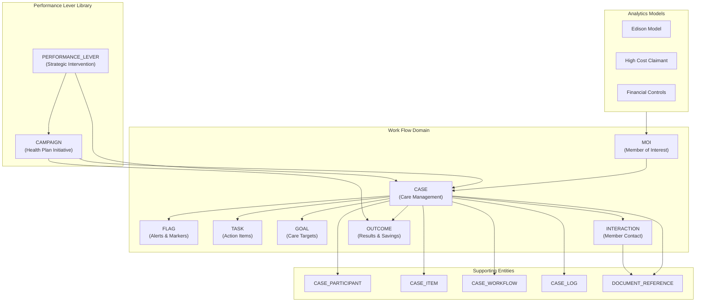
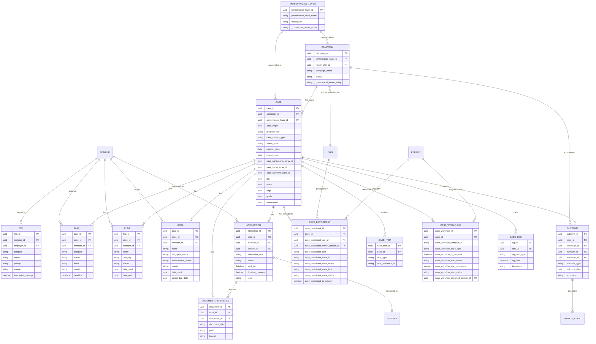

# Campaigns, Cases, and Interactions Schema Group

This document defines the complete Work Flow domain — the entities that power campaign management, case management, task tracking, member flags, care goals, interactions, and outcomes within the Wellnecity platform.

**SDK Source**: `wellnecity_sdk/wncty/classes/data/workqueue/` (Python Pydantic models)
**MongoDB**: `pmi_dev` database (patient_case, outcomes, members_of_interest, work_queue)
**BigQuery Target**: `edm_intervention` dataset

---

## Overview

The Work Flow domain extends the INTERVENTION TLD with entities that map directly to the SDK's work flow classes. It covers the full lifecycle of member care management — from flagging a member of interest, through case creation, task/goal assignment, interactions, and outcome tracking.



---

## Entity Relationship Diagram



---

## SDK to EDM Traceability

| SDK Class | SDK File | EDM Entity | Notes |
|-----------|----------|------------|-------|
| `aWork_Queue` | `aWork_Queue.py` | *(base fields)* | Common fields inherited by TASK, FLAG, GOAL |
| `aCase` / `Case_Simple` | `aCase.py` | **CASE** | Enhanced with SDK fields |
| `aTask` / `Task_Simple` | `aTask.py` | **TASK** | New entity |
| `aFlag` / `Flag_Simple` | `aFlag.py` | **FLAG** | New entity |
| `aGoal` / `Goal_Simple` | `aGoal.py` | **GOAL** | New entity |
| `aInteraction` / `Interaction_Simple` | `aInteraction.py` | **INTERACTION** | Enhanced with SDK fields |
| `aOutcome` / `Outcome_Simple` | `aOutcome.py` | **OUTCOME** | Enhanced with SDK fields |
| `MemberOfInterest` | `models.py` | **MOI** | Existing entity |
| *(participant fields)* | `aCase.py` | **CASE_PARTICIPANT** | JSON in Mongo, table in BQ; FKs to ORG/PERSON (PR #5) |
| *(workflow steps)* | `aCase.py` | **CASE_WORKFLOW** | JSON in Mongo, table in BQ; steps from Performance Lever Library |
| `caseItemsModel` | `aCase.py` | **CASE_ITEM** | JSON in Mongo, table in BQ |
| `caseLog` | `aCase.py` | **CASE_LOG** | JSON in Mongo, table in BQ |
| `aDocumentReference` | `aInteraction.py` | **DOCUMENT_REFERENCE** | New entity |

---

## Entity: CASE

The central work flow entity. Represents a care management case, generated manually or from analytics models (MOI, financial controls). Each case belongs to a **Campaign** (scoped by health plan) and rolls up to a **Performance Lever** from the Wellnecity Performance Lever Library. Related data — MOIs, Members, Claims, Prescriptions, Parent Cases — are linked through **CASE_ITEM** (a robust linking table). Case Participants — the organizations and individuals involved — are stored in **CASE_PARTICIPANT** (one row per participating organization, each with its own case ID, name, type, status, and owner). Workflow steps — pulled from the Performance Lever Library at case creation — are stored in **CASE_WORKFLOW**.

**SDK Source**: `aCase`, `Case_Simple`, `Case_Simple2`
**MongoDB**: `pmi_dev.patient_case` (72,770), `datahub_gold_pmm_dev.moi_case` (1,655), `datahub_gold_pmm_dev.financial_controls_case` (1,981)
**BigQuery**: `edm_intervention.case`
**Storage**: Document in MongoDB; flattened row in BigQuery

| # | Field | Type | Constraints | Domain | Description |
|---|-------|------|-------------|--------|-------------|
| 1 | `case_id` | uuid | PK, R | Identity & Origin | Unique case identifier |
| 2 | `case_origin` | json | R | Identity & Origin | Origin(s) of the case — JSON array of sources (e.g. patient, moi, financial_control, referral, analytics) |
| 3 | `case_subject_type` | string(20) | | Identity & Origin | Subject type (Patient) |
| 4 | `case_participants_array_id` | json | | Case Participants | Participant array (JSON in Mongo; exploded to CASE_PARTICIPANT in BQ) |
| 5 | `campaign_id` | uuid | FK, I | Campaign & Performance Lever | Reference to CAMPAIGN (conceptual — future entity) |
| 6 | `campaign_name` | string(255) | | Campaign & Performance Lever | Denormalized campaign name |
| 7 | `campaign_health_plan_id` | uuid | FK, I | Campaign & Performance Lever | Reference to ORG — the health plan that scopes this campaign |
| 8 | `campaign_health_plan_name` | string(255) | | Campaign & Performance Lever | Denormalized health plan name |
| 9 | `program_key` | string(100) | I | Campaign & Performance Lever | Analytics program key (edison_model_1, nadac_reprice, etc.) |
| 10 | `performance_lever_id` | uuid | FK, I | Campaign & Performance Lever | Reference to PERFORMANCE_LEVER (conceptual — future entity) |
| 11 | `performance_lever_name` | string(255) | | Campaign & Performance Lever | Denormalized performance lever name |
| 12 | `case_items_array_id` | json | | Case Items | Case items array (JSON in Mongo; exploded to CASE_ITEM in BQ) |
| 13 | `case_workflow_array_id` | json | | Case WorkFlow | Workflow steps array (JSON in Mongo; exploded to CASE_WORKFLOW in BQ) |
| 14 | `tasks` | json | | Case WorkFlow | Tasks array (JSON in Mongo; exploded to TASK in BQ) |
| 15 | `flags` | json | | Case WorkFlow | Flags array (JSON in Mongo; exploded to FLAG in BQ) |
| 16 | `interactions` | json | | Case WorkFlow | Interactions array (JSON in Mongo; exploded to INTERACTION in BQ) |
| 17 | `status_state` | string(20) | | Lifecycle & Dates | Lifecycle category: active, resolved |
| 18 | `due_date` | date | | Lifecycle & Dates | Case due date |
| 19 | `initiated_date` | date | R | Lifecycle & Dates | Date case was created |
| 20 | `closed_date` | date | | Lifecycle & Dates | Date case was closed |
| 21 | `last_activity_date` | datetime | | Lifecycle & Dates | Timestamp of last activity |
| 22 | `is_deleted` | boolean | R | Case Display | Soft delete flag |
| 23 | `is_archived` | boolean | R | Case Display | Archive flag |
| 24 | `is_hidden` | boolean | R | Case Display | Hidden from default views |
| 25 | `notes` | json | | Notes & Other Extensions | Notes array (JSON in both Mongo and BQ) |
| 26 | `extension` | json | | Notes & Other Extensions | FHIR extension data |
| 27 | `goals` | json | | Case Outcomes | Goals array (JSON in Mongo; exploded to GOAL in BQ) |
| 28 | `identified_savings_total` | decimal(14,2) | | Case Outcomes | Total identified savings |
| 29 | `realized_savings_total` | decimal(14,2) | | Case Outcomes | Total realized savings |
| 30 | `last_realized_date` | date | | Case Outcomes | Date of last realized savings |
| 31 | `log` | json | | Audit | Case audit log array (JSON in Mongo; exploded to CASE_LOG in BQ) |
| 32 | `created_at` | datetime | R | Audit | Record creation timestamp |
| 33 | `updated_at` | datetime | R | Audit | Last update timestamp |
| 34 | `created_by` | string(100) | | Audit | Creator user ID |
| 35 | `updated_by` | string(100) | | Audit | Last updater user ID |

### SDK Field Mapping (CASE)

| SDK Field (aCase) | EDM Field | Notes |
|--------------------|-----------|-------|
| `id` / `_id` | `case_id` | ObjectId → UUID |
| `source` + `referralSource` | `case_origin` | Merged into JSON array of origins |
| `wellnecityId` | → CASE_PARTICIPANT `.case_participant_case_id` | Wellnecity participant row |
| `caseId` | → CASE_PARTICIPANT `.case_participant_case_id` | External participant rows |
| `name` | → CASE_PARTICIPANT `.case_participant_case_name` | Per-party case name |
| `description` | → CASE_PARTICIPANT `.case_participant_case_description` | Per-party description |
| `type.value` | → CASE_PARTICIPANT `.case_participant_case_type` | Per-party type |
| `type.display` | → CASE_PARTICIPANT `.case_participant_case_type_display` | Per-party type display |
| `caseSubtype` | → CASE_PARTICIPANT `.case_participant_case_subtype` | Per-party subtype |
| `caseSubtypeList` | → CASE_PARTICIPANT `.case_participant_case_subtype_list` | Per-party subtypes |
| `programKey` | `program_key` | |
| `status.value` | → CASE_PARTICIPANT `.case_participant_case_status` | Per-party status |
| `status.display` | → CASE_PARTICIPANT `.case_participant_case_status_display` | Per-party status display |
| `status.state` | `status_state` | Lifecycle state stays on CASE |
| `vendorCaseStatus` | → CASE_PARTICIPANT `.case_participant_case_status` | Vendor participant row |
| `owner` | → CASE_PARTICIPANT `.case_participant_owner_person_id` | Per-party owner (PERSON FK) |
| `subject.id` | → CASE_ITEM `.item_id` (item_type='member') | Member linked via CASE_ITEM |
| `subjectType` | `case_subject_type` | |
| `client.id` | → CASE_PARTICIPANT `.case_participant_org_id` | Employer participant row |
| `dueDate` | `due_date` | |
| `initiatedDate` | `initiated_date` | |
| `closedDate` | `closed_date` | |
| `lastActivityDate` | `last_activity_date` | |
| `isHidden` | `is_hidden` | |
| `notes` | `notes` | Array → JSON |
| `savingStats.identifiedSavingsTotal` | `identified_savings_total` | |
| `savingStats.realizedSavingsTotal` | `realized_savings_total` | |
| `savingStats.lastRealizedDate` | `last_realized_date` | |
| `extension` | `extension` | Array → JSON |
| `campaignId` | `campaign_id` | Campaign reference (conceptual) |
| `campaignName` | `campaign_name` | Denormalized |
| `campaignHealthPlanId` | `campaign_health_plan_id` | Health plan ORG reference |
| `campaignHealthPlanName` | `campaign_health_plan_name` | Denormalized |
| `performanceLeverId` | `performance_lever_id` | Performance Lever reference (conceptual) |
| `performanceLeverName` | `performance_lever_name` | Denormalized |
| `participants[]` | `case_participants_array_id` → CASE_PARTICIPANT table | JSON in Mongo, table in BQ |
| `items[]` | `case_items_array_id` → CASE_ITEM table | JSON in Mongo, table in BQ |
| `workflow[]` | `case_workflow_array_id` → CASE_WORKFLOW table | JSON in Mongo, table in BQ |
| `log[]` | `log` → CASE_LOG table | JSON in Mongo, table in BQ |
| `linkedModules[]` (tasks) | `tasks` → TASK table | JSON in Mongo, table in BQ |
| `linkedModules[]` (flags) | `flags` → FLAG table | JSON in Mongo, table in BQ |
| `linkedModules[]` (goals) | `goals` → GOAL table | JSON in Mongo, table in BQ |
| `linkedModules[]` (interactions) | `interactions` → INTERACTION table | JSON in Mongo, table in BQ |
| `documents[]` | → DOCUMENT_REFERENCE table | Separate entity in BQ |

**Relationships**:
- CASE N:1 CAMPAIGN (belongs to / summarized by — conceptual, future entity)
- CASE N:1 PERFORMANCE_LEVER (rolls up to — conceptual, future entity)
- CASE N:1 ORG (campaign scoped by health plan — via campaign_health_plan_id)
- CASE 1:N CASE_PARTICIPANT (has participants — Wellnecity, employer, TPA, vendor, etc.)
- CASE 1:N CASE_ITEM (links to MOI, Member, Claim, Prescription, Parent Case, etc.)
- CASE 1:N CASE_WORKFLOW (has workflow steps)
- CASE 1:N CASE_LOG (tracks)
- CASE 1:N TASK (has tasks)
- CASE 1:N FLAG (has flags)
- CASE 1:N GOAL (has goals)
- CASE 1:N INTERACTION (has interactions)
- CASE 1:1 OUTCOME (results in)
- CASE 1:N DOCUMENT_REFERENCE (has documents)

**Business Rules**:
- `case_origin` is a JSON array of sources (patient, moi, financial_control, referral, analytics); supports multiple origins per case
- `program_key` is required for moi and financial_control origins
- `closed_date` must be set when `status_state` transitions to resolved
- `campaign_id` references a Campaign (conceptual — future entity); Campaigns are scoped by health plan
- `campaign_health_plan_id` references the ORG (health plan) that scopes the campaign; Campaigns can be aggregated/filtered by Employer, Vendor, Broker via CASE_PARTICIPANT
- `performance_lever_id` references a Performance Lever from the Wellnecity Performance Lever Library (conceptual — future entity)
- Both Case and Campaign roll up to a Performance Lever
- `case_participants_array_id[]` stored as JSON array in MongoDB; exploded to CASE_PARTICIPANT table in BigQuery
- `case_workflow_array_id[]` stored as JSON array in MongoDB; exploded to CASE_WORKFLOW table in BigQuery
- `case_items_array_id[]` and `log[]` stored as JSON arrays in MongoDB; exploded to separate tables in BigQuery
- Each case must have at least one CASE_PARTICIPANT with `case_participant_is_primary = true`
- Case Participants (case ID, name, type, status, owner) live on CASE_PARTICIPANT, not CASE
- Wellnecity is a participant like any other — no internal/external distinction
- MOI, Member, Claim, Prescription, and Parent Case are linked via CASE_ITEM — not as direct FKs on CASE
- CASE_ITEM is a robust linking table that allows Case Managers to associate data with a case
- Workflow steps are pulled from the Performance Lever Library at case creation for Wellnecity-originated cases

**Indexes**:
- `idx_case_program` (program_key)
- `idx_case_origin` (case_origin)
- `idx_case_initiated` (initiated_date)
- `idx_case_campaign` (campaign_id)
- `idx_case_health_plan` (campaign_health_plan_id)
- `idx_case_perf_lever` (performance_lever_id)

---

## Entity: CASE_PARTICIPANT

Case Participants domain — a participating organization's view of and involvement with a case. Each party (Wellnecity, employer, TPA, vendor, clinical partner) gets its own row with its own case identifier, name, type, status, and owner. All parties are treated equally — Wellnecity is just another participant. Fields organized across 4 domains: Identity, Organization & Ownership, Case Descriptors, and Audit.

**SDK Source**: Participant fields from `aCase` (wellnecityId, caseId, name, type, status, owner, client)
**MongoDB**: Embedded JSON array in `patient_case.participants[]`
**BigQuery**: `edm_intervention.case_participant` (separate table)
**Storage**: JSON array in MongoDB; separate table in BigQuery
**ORG/PERSON Integration**: FKs reference ORG and PERSON entities from PR #5 (`feature/org-employer-client-vendor-broker`)

| # | Field | Type | Constraints | Domain | Description |
|---|-------|------|-------------|--------|-------------|
| 1 | `case_participant_id` | uuid | PK, R | Identity | Unique row identifier |
| 2 | `case_id` | uuid | FK, R, I | Identity | Reference to CASE |
| 3 | `case_participant_org_id` | uuid | FK, R, I | Organization & Ownership | Reference to ORG (the participating organization) |
| 4 | `case_participant_owner_person_id` | uuid | FK, I | Organization & Ownership | Reference to PERSON (case owner/contact at that org, optional) |
| 5 | `case_participant_role` | string(50) | R, I | Organization & Ownership | Role in this case: originator, tpa, vendor, employer, clinical_partner, carrier, broker |
| 6 | `case_participant_is_primary` | boolean | R | Organization & Ownership | Whether this is the primary/originating participant |
| 7 | `case_participant_case_id` | string(100) | I | Case Descriptors | This party's case ID / reference number |
| 8 | `case_participant_case_name` | string(255) | | Case Descriptors | This party's name/label for the case |
| 9 | `case_participant_case_description` | string | | Case Descriptors | This party's description of the case |
| 10 | `case_participant_case_type` | string(50) | | Case Descriptors | This party's case type classification |
| 11 | `case_participant_case_type_display` | string(100) | | Case Descriptors | Display name for case type |
| 12 | `case_participant_case_subtype` | string(50) | | Case Descriptors | This party's subtype |
| 13 | `case_participant_case_subtype_list` | json | | Case Descriptors | Array of subtypes |
| 14 | `case_participant_case_status` | string(30) | I | Case Descriptors | This party's status for the case |
| 15 | `case_participant_case_status_display` | string(50) | | Case Descriptors | Status display name |
| 16 | `is_deleted` | boolean | R | Audit | Soft delete flag |
| 17 | `created_at` | datetime | R | Audit | Record creation timestamp |
| 18 | `updated_at` | datetime | R | Audit | Last update timestamp |

### SDK Field Mapping (CASE_PARTICIPANT)

| SDK Field (aCase) | EDM Field | Notes |
|--------------------|-----------|-------|
| `wellnecityId` | `case_participant_case_id` | Wellnecity participant row (case_participant_role='originator') |
| `caseId` | `case_participant_case_id` | External participant rows |
| `name` | `case_participant_case_name` | Per-party case name |
| `description` | `case_participant_case_description` | Per-party description |
| `type.value` | `case_participant_case_type` | |
| `type.display` | `case_participant_case_type_display` | |
| `caseSubtype` | `case_participant_case_subtype` | |
| `caseSubtypeList` | `case_participant_case_subtype_list` | Array → JSON |
| `status.value` | `case_participant_case_status` | Per-party status |
| `status.display` | `case_participant_case_status_display` | |
| `vendorCaseStatus` | `case_participant_case_status` | Vendor participant row |
| `owner` | `case_participant_owner_person_id` | Owner mapped to PERSON FK |
| `client.id` | `case_participant_org_id` | Employer participant row (case_participant_role='employer') |

### MongoDB Document Example

```json
{
  "_id": "abc-123",
  "participants": [
    {
      "case_participant_org_id": "WNC-001",
      "case_participant_role": "originator",
      "case_participant_case_id": "CAS-00451",
      "case_participant_case_name": "High Cost Claimant Review",
      "case_participant_case_type": "member-of-interest",
      "case_participant_case_status": "inprogress",
      "case_participant_owner_person_id": "PER-001",
      "case_participant_is_primary": true
    },
    {
      "case_participant_org_id": "ABC-001",
      "case_participant_role": "employer",
      "case_participant_case_id": "EMP-CASE-7712",
      "case_participant_case_name": "Employee Wellness Case",
      "case_participant_case_status": "open"
    },
    {
      "case_participant_org_id": "BH-001",
      "case_participant_role": "tpa",
      "case_participant_case_id": "BH-2026-44109",
      "case_participant_case_status": "under_review"
    }
  ]
}
```

**Relationships**:
- CASE_PARTICIPANT N:1 CASE (belongs to)
- CASE_PARTICIPANT N:1 ORG (participating organization — via case_participant_org_id, from PR #5)
- CASE_PARTICIPANT N:1 PERSON (case owner — via case_participant_owner_person_id, from PR #5, optional)

**Business Rules**:
- Each case must have at least one participant with `case_participant_is_primary = true`
- Wellnecity is a participant with `case_participant_role = 'originator'` — not treated as internal
- `case_participant_org_id` references the ORG entity (PR #5); all party types (employer, vendor, TPA, carrier, broker) are ORGs
- `case_participant_owner_person_id` optionally references the PERSON entity (PR #5) for the case owner at that org
- `case_participant_role` is case-context-specific (an ORG may be globally an EMPLOYER but an "originator" on a specific case)
- `case_participant_case_id` is unique per participant within a case (not globally unique)
- Stored as JSON array in MongoDB (`case.participants[]`); each element becomes a row in BigQuery

**Indexes**:
- `idx_participant_case` (case_id)
- `idx_participant_org` (case_participant_org_id)
- `idx_participant_role` (case_participant_role)
- `idx_participant_status` (case_participant_case_status)
- `idx_participant_case_id` (case_participant_case_id)

---

## Entity: CASE_WORKFLOW

A workflow step within a case — either a template step pulled from the Wellnecity Performance Lever Library at case creation, or an ad-hoc planned step added during case management. Each row represents one step in the workflow sequence. The template set is determined by the Wellnecity Case Type (defined in the Performance Lever Library) and instantiated when a Wellnecity-originated case is created. Fields organized across 4 domains: Identity, Template Origin, Step Definition, and Audit.

**SDK Source**: Workflow step fields from `aCase` (workflow[])
**MongoDB**: Embedded JSON array in `patient_case.workflow[]`
**BigQuery**: `edm_intervention.case_workflow` (separate table)
**Storage**: JSON array in MongoDB; separate table in BigQuery
**Performance Lever Library**: Case Types and workflow templates are defined in the Wellnecity Performance Lever Library

| # | Field | Type | Constraints | Domain | Description |
|---|-------|------|-------------|--------|-------------|
| 1 | `case_workflow_id` | uuid | PK, R | Identity | Unique workflow step identifier |
| 2 | `case_id` | uuid | FK, R, I | Identity | Reference to CASE |
| 3 | `case_workflow_template_id` | string(100) | I | Template Origin | Performance Lever Library template step ID (null if ad-hoc) |
| 4 | `case_workflow_template_name` | string(255) | | Template Origin | Performance Lever Library template name |
| 5 | `case_workflow_case_type` | string(50) | I | Template Origin | Wellnecity Case Type that sourced this step |
| 6 | `case_workflow_is_template` | boolean | R | Template Origin | Whether this step came from a template (vs. ad-hoc) |
| 7 | `case_workflow_step_name` | string(255) | R | Step Definition | Step name/title |
| 8 | `case_workflow_step_description` | string | | Step Definition | Step description / instructions |
| 9 | `case_workflow_step_sequence` | integer | R | Step Definition | Order in the workflow (1, 2, 3...) |
| 10 | `case_workflow_step_category` | string(50) | | Step Definition | Category: assessment, outreach, review, authorization, referral, closure |
| 11 | `case_workflow_step_status` | string(30) | R, I | Step Definition | Status: pending, in_progress, completed, skipped, blocked |
| 12 | `case_workflow_step_status_display` | string(50) | | Step Definition | Status display name |
| 13 | `case_workflow_due_date` | date | | Step Definition | When this step is due |
| 14 | `case_workflow_completed_date` | date | | Step Definition | When this step was completed |
| 15 | `case_workflow_assigned_person_id` | uuid | FK, I | Step Definition | Reference to PERSON assigned to this step |
| 16 | `is_deleted` | boolean | R | Audit | Soft delete flag |
| 17 | `created_at` | datetime | R | Audit | Record creation timestamp |
| 18 | `updated_at` | datetime | R | Audit | Last update timestamp |

### MongoDB Document Example

```json
{
  "_id": "abc-123",
  "workflow": [
    {
      "case_workflow_template_id": "TPL-MOI-001",
      "case_workflow_template_name": "MOI High Cost Workflow",
      "case_workflow_case_type": "member-of-interest",
      "case_workflow_is_template": true,
      "case_workflow_step_name": "Initial Assessment",
      "case_workflow_step_sequence": 1,
      "case_workflow_step_category": "assessment",
      "case_workflow_step_status": "completed",
      "case_workflow_completed_date": "2026-01-16"
    },
    {
      "case_workflow_template_id": "TPL-MOI-002",
      "case_workflow_template_name": "MOI High Cost Workflow",
      "case_workflow_case_type": "member-of-interest",
      "case_workflow_is_template": true,
      "case_workflow_step_name": "Member Outreach",
      "case_workflow_step_sequence": 2,
      "case_workflow_step_category": "outreach",
      "case_workflow_step_status": "in_progress",
      "case_workflow_assigned_person_id": "PER-001"
    },
    {
      "case_workflow_is_template": false,
      "case_workflow_step_name": "Specialist Referral Follow-up",
      "case_workflow_step_sequence": 3,
      "case_workflow_step_category": "referral",
      "case_workflow_step_status": "pending"
    }
  ]
}
```

**Relationships**:
- CASE_WORKFLOW N:1 CASE (belongs to)
- CASE_WORKFLOW N:1 PERSON (assigned to — via case_workflow_assigned_person_id, from PR #5, optional)

**Business Rules**:
- Workflow steps are pulled from the Wellnecity Performance Lever Library at case creation for Wellnecity-originated cases
- `case_workflow_is_template = true` indicates the step came from the Performance Lever Library; `false` indicates ad-hoc
- `case_workflow_template_id` ties back to the Performance Lever Library template step; null for ad-hoc steps
- `case_workflow_case_type` captures which Wellnecity Case Type sourced the template
- `case_workflow_step_sequence` defines the ordering of steps within a case
- `case_workflow_assigned_person_id` optionally references the PERSON entity (PR #5) for step assignment
- `case_workflow_completed_date` must be set when `case_workflow_step_status` transitions to completed
- Stored as JSON array in MongoDB (`case.workflow[]`); each element becomes a row in BigQuery

**Indexes**:
- `idx_workflow_case` (case_id)
- `idx_workflow_template` (case_workflow_template_id)
- `idx_workflow_case_type` (case_workflow_case_type)
- `idx_workflow_status` (case_workflow_step_status)
- `idx_workflow_assigned` (case_workflow_assigned_person_id)

---

## Entity: TASK

An action item within a case. Tasks represent discrete work items assigned to care managers — claims review, insurance verification, member outreach, etc.

**SDK Source**: `aTask` (extends `aWork_Queue`)
**MongoDB**: `pmi_dev.work_queue` (type=task)
**BigQuery**: `edm_intervention.task`
**Storage**: Document in MongoDB; flattened row in BigQuery

| Field | Type | Constraints | Description |
|-------|------|-------------|-------------|
| `task_id` | uuid | PK, R | Unique task identifier |
| `case_id` | uuid | FK, I | Reference to CASE |
| `member_id` | uuid | FK, R, I | Reference to MEMBER (subject) |
| `employer_id` | uuid | FK, R, I | Reference to EMPLOYER (client) |
| `category` | string(50) | R | Task category: Claim, Insurance, Member |
| `status` | string(30) | R, I | Status: Accepted, Cancelled, Completed, Draft, EnteredInError, Failed, InProgress, OnHold, Ready, Received, Rejected, Requested |
| `intent` | string(30) | R | FHIR Task intent: FillerOrder, InstanceOrder, Option, Order, OriginalOrder, Plan, Proposal, ReflexOrder |
| `priority` | string(20) | | Priority: ASAP, Routine, STAT, Urgent |
| `message` | string | | User-facing display message |
| `deadline` | datetime | | Task deadline |
| `start_date` | datetime | | Task start date |
| `completed_on` | datetime | | Task completion timestamp |
| `assigned_to` | uuid | FK, I | Assigned owner (PMI user) |
| `assigned_to_name` | string(255) | | Denormalized owner name |
| `notes` | json | | Notes array |
| `is_deleted` | boolean | R | Soft delete flag |
| `is_archived` | boolean | R | Archive flag |
| `is_acknowledged` | boolean | R | Acknowledgment flag |
| `created_at` | datetime | R | Record creation timestamp |
| `updated_at` | datetime | R | Last update timestamp |
| `created_by` | string(100) | | Creator user ID |
| `updated_by` | string(100) | | Last updater user ID |

### SDK Field Mapping (TASK)

| SDK Field (aTask + aWork_Queue) | EDM Field | Notes |
|----------------------------------|-----------|-------|
| `id` / `_id` | `task_id` | ObjectId → UUID |
| `subject.id` | `member_id` | Patient ref → member FK |
| `client` | `employer_id` | Client code → employer FK |
| `category` | `category` | |
| `status` | `status` | |
| `intent` | `intent` | FHIR Task.intent |
| `priority` | `priority` | |
| `message` | `message` | |
| `deadline` | `deadline` | |
| `start_date` | `start_date` | |
| `completed_on` | `completed_on` | |
| `owner` | `assigned_to` | PMI user ref |
| `notes[]` | `notes` | Array → JSON |
| `is_deleted` | `is_deleted` | |
| `is_archived` | `is_archived` | |
| `is_acknowledged` | `is_acknowledged` | |
| `created` | `created_at` | |
| `updated` | `updated_at` | |
| `created_by` | `created_by` | User ref → ID |
| `updated_by` | `updated_by` | User ref → ID |
| `linkedModules[]` | `case_id` | Resolved to direct FK |

**Relationships**:
- TASK N:1 CASE (belongs to)
- TASK N:1 MEMBER (subject)
- TASK N:1 EMPLOYER (client)

**Business Rules**:
- Tasks follow FHIR Task resource semantics for `intent` and `status`
- `completed_on` must be set when status transitions to Completed
- `priority` STAT and ASAP require immediate attention
- `linkedModules` from SDK resolved to `case_id` FK in EDM

**Indexes**:
- `idx_task_case` (case_id)
- `idx_task_member` (member_id)
- `idx_task_status` (status)
- `idx_task_assigned` (assigned_to)

---

## Entity: FLAG

A marker or alert on a member. Flags identify conditions, risk factors, or attributes that require attention — VIP status, age thresholds, risk alerts.

**SDK Source**: `aFlag` (extends `aWork_Queue`)
**MongoDB**: `pmi_dev.work_queue` (type=flag)
**BigQuery**: `edm_intervention.flag`
**Storage**: Document in MongoDB; flattened row in BigQuery

| Field | Type | Constraints | Description |
|-------|------|-------------|-------------|
| `flag_id` | uuid | PK, R | Unique flag identifier |
| `case_id` | uuid | FK, I | Reference to CASE |
| `member_id` | uuid | FK, R, I | Reference to MEMBER (subject) |
| `employer_id` | uuid | FK, R, I | Reference to EMPLOYER (client) |
| `name` | string(100) | R | Flag name (VIP, Age, Risk, etc.) |
| `category` | string(50) | R | Flag category classification |
| `status` | string(30) | R, I | Flag status |
| `message` | string | | Flag value/display message |
| `date_start` | date | | Flag effective start date |
| `date_end` | date | | Flag effective end date |
| `assigned_to` | uuid | FK, I | Assigned owner |
| `is_deleted` | boolean | R | Soft delete flag |
| `is_archived` | boolean | R | Archive flag |
| `is_acknowledged` | boolean | R | Acknowledgment flag |
| `created_at` | datetime | R | Record creation timestamp |
| `updated_at` | datetime | R | Last update timestamp |
| `created_by` | string(100) | | Creator user ID |
| `updated_by` | string(100) | | Last updater user ID |

### SDK Field Mapping (FLAG)

| SDK Field (aFlag + aWork_Queue) | EDM Field | Notes |
|----------------------------------|-----------|-------|
| `id` / `_id` | `flag_id` | ObjectId → UUID |
| `subject.id` | `member_id` | Patient ref → member FK |
| `client` | `employer_id` | Client code → employer FK |
| `name` | `name` | |
| `category` / `CATEGORY` | `category` | Alias support |
| `status` / `STATUS` | `status` | |
| `message` / `VALUE` | `message` | |
| `date_start` / `STARTDATE` | `date_start` | |
| `date_end` / `ENDDATE` | `date_end` | |
| `owner` | `assigned_to` | |
| `is_deleted` | `is_deleted` | |
| `is_archived` | `is_archived` | |
| `is_acknowledged` | `is_acknowledged` | |
| `created` | `created_at` | |
| `updated` | `updated_at` | |
| `created_by` | `created_by` | |
| `updated_by` | `updated_by` | |
| `linkedModules[]` | `case_id` | Resolved to direct FK |

**Relationships**:
- FLAG N:1 CASE (belongs to)
- FLAG N:1 MEMBER (subject)
- FLAG N:1 EMPLOYER (client)

**Business Rules**:
- Flags map to FHIR Flag resources
- `date_start` and `date_end` define the active period
- A flag with no `date_end` is considered currently active
- `name` + `member_id` should be unique for active flags

**Indexes**:
- `idx_flag_case` (case_id)
- `idx_flag_member` (member_id)
- `idx_flag_name` (name)
- `idx_flag_status` (status)

---

## Entity: GOAL

A care management goal for a member. Goals define measurable targets with achievement tracking — medication adherence, appointment compliance, health metrics.

**SDK Source**: `aGoal` (extends `aWork_Queue`)
**MongoDB**: `pmi_dev.work_queue` (type=goal)
**BigQuery**: `edm_intervention.goal`
**Storage**: Document in MongoDB; flattened row in BigQuery

| Field | Type | Constraints | Description |
|-------|------|-------------|-------------|
| `goal_id` | uuid | PK, R | Unique goal identifier |
| `case_id` | uuid | FK, I | Reference to CASE |
| `member_id` | uuid | FK, R, I | Reference to MEMBER (subject) |
| `employer_id` | uuid | FK, R, I | Reference to EMPLOYER (client) |
| `name` | string(255) | R | Goal name/title |
| `categories` | json | | Goal category list (JSON array) |
| `life_cycle_status` | string(30) | R | Lifecycle: Proposed, Planned, Accepted, Active, OnHold, Completed, Cancelled, EnteredInError, Rejected |
| `achievement_status` | string(30) | | Achievement: InProgress, Improving, Worsening, NoChange, Achieved, Sustaining, NotAchieved, NoProgress, NotAttainable |
| `priority` | string(20) | | Priority level |
| `date_start` | date | R | Goal start date |
| `target_due_date` | date | | Target completion date |
| `target_measure_type` | string(30) | | Measure type: quantity, ratio, range, string, boolean, integer, codeableconcept |
| `target_measure_value` | json | | Target measure value (varies by type) |
| `target_measure_system` | string(255) | | Coding system for target |
| `addresses` | string | | What the goal addresses (condition, concern) |
| `outcome` | json | | Associated outcomes (JSON array) |
| `message` | string | | User-facing display message |
| `assigned_to` | uuid | FK, I | Assigned owner |
| `notes` | json | | Notes array |
| `is_deleted` | boolean | R | Soft delete flag |
| `is_archived` | boolean | R | Archive flag |
| `is_acknowledged` | boolean | R | Acknowledgment flag |
| `created_at` | datetime | R | Record creation timestamp |
| `updated_at` | datetime | R | Last update timestamp |
| `created_by` | string(100) | | Creator user ID |
| `updated_by` | string(100) | | Last updater user ID |

### SDK Field Mapping (GOAL)

| SDK Field (aGoal + aWork_Queue) | EDM Field | Notes |
|----------------------------------|-----------|-------|
| `id` / `_id` | `goal_id` | ObjectId → UUID |
| `subject.id` | `member_id` | Patient ref → member FK |
| `client` | `employer_id` | Client code → employer FK |
| `name` | `name` | |
| `category` | `categories` | list → JSON array |
| `life_cycle_status` | `life_cycle_status` | FHIR Goal.lifecycleStatus |
| `achievement_status` | `achievement_status` | FHIR Goal.achievementStatus |
| `priority` | `priority` | |
| `date_start` | `date_start` | |
| `target_due_date` | `target_due_date` | |
| `target_measure.type` | `target_measure_type` | |
| `target_measure.value` | `target_measure_value` | dict/str/bool/int → JSON |
| `target_measure.system` | `target_measure_system` | |
| `addresses` | `addresses` | |
| `outcome` | `outcome` | list → JSON array |
| `message` | `message` | |
| `owner` | `assigned_to` | |
| `notes[]` | `notes` | Array → JSON |
| `linkedModules[]` | `case_id` | Resolved to direct FK |

**Relationships**:
- GOAL N:1 CASE (belongs to)
- GOAL N:1 MEMBER (subject)
- GOAL N:1 EMPLOYER (client)

**Business Rules**:
- Goals follow FHIR Goal resource semantics for lifecycle and achievement status
- `life_cycle_status` is required; `achievement_status` tracks progress
- `target_measure_type` determines the shape of `target_measure_value`
- Lifecycle progression: Proposed → Planned → Accepted → Active → Completed/Cancelled

**Indexes**:
- `idx_goal_case` (case_id)
- `idx_goal_member` (member_id)
- `idx_goal_lifecycle` (life_cycle_status)
- `idx_goal_achievement` (achievement_status)

---

## Entity: INTERACTION

A contact event between a care team member and a patient. Tracks phone calls, emails, in-person visits, and other communication touchpoints.

**SDK Source**: `aInteraction` (extends `aWork_Queue`)
**MongoDB**: `pmi_dev.work_queue` (type=Interaction)
**BigQuery**: `edm_intervention.interaction`
**Storage**: Document in MongoDB; flattened row in BigQuery

| Field | Type | Constraints | Description |
|-------|------|-------------|-------------|
| `interaction_id` | uuid | PK, R | Unique interaction identifier |
| `case_id` | uuid | FK, I | Reference to CASE |
| `member_id` | uuid | FK, R, I | Reference to MEMBER (subject) |
| `employer_id` | uuid | FK, I | Reference to EMPLOYER (client) |
| `partner_id` | uuid | FK, I | Reference to PARTNER (conducting org) |
| `interaction_type` | string(30) | R | Type: Interaction |
| `medium` | json | | Interaction methods (phone, email, in-person, etc.) JSON array |
| `topic` | string(255) | R | Reason for interaction |
| `categories` | json | | Interaction category list (JSON array) |
| `status` | string(30) | R, I | Interaction status |
| `status_reason` | string(255) | | Reason for current status |
| `priority` | string(20) | | Priority level |
| `sent_on` | datetime | R | Date/time interaction occurred |
| `duration_minutes` | decimal(8,2) | | Length of interaction in minutes |
| `description` | string | | Interaction description |
| `message` | string | | User-facing display message |
| `encounter_reference` | string(100) | | Reference to FHIR Encounter |
| `assigned_to` | uuid | FK, I | Assigned owner |
| `recorded_by` | string(100) | | User who recorded the interaction |
| `recorded_by_name` | string(255) | | Denormalized recorder name |
| `notes` | json | | Notes array |
| `reassign_history` | json | | Reassignment log (JSON array of {date, from, to, by}) |
| `is_deleted` | boolean | R | Soft delete flag |
| `is_archived` | boolean | R | Archive flag |
| `is_acknowledged` | boolean | R | Acknowledgment flag |
| `created_at` | datetime | R | Record creation timestamp |
| `updated_at` | datetime | R | Last update timestamp |
| `created_by` | string(100) | | Creator user ID |
| `updated_by` | string(100) | | Last updater user ID |

### SDK Field Mapping (INTERACTION)

| SDK Field (aInteraction + aWork_Queue) | EDM Field | Notes |
|-----------------------------------------|-----------|-------|
| `id` / `_id` | `interaction_id` | ObjectId → UUID |
| `subject.id` | `member_id` | Patient ref → member FK |
| `client` | `employer_id` | Client code → employer FK |
| `type` | `interaction_type` | Default "Interaction" |
| `medium` | `medium` | list → JSON array |
| `topic` | `topic` | |
| `categories` | `categories` | list → JSON array |
| `status` | `status` | |
| `status_reason` | `status_reason` | |
| `priority` | `priority` | |
| `sent_on` | `sent_on` | datetime |
| `duration` | `duration_minutes` | float → decimal |
| `description` | `description` | |
| `message` | `message` | |
| `encounter_reference` | `encounter_reference` | FHIR Encounter ref |
| `owner` | `assigned_to` | |
| `recorded_by` | `recorded_by` | User ref → ID |
| `notes[]` | `notes` | Array → JSON |
| `documents[]` | → DOCUMENT_REFERENCE table | Separate entity |
| `interactionHistory[]` | `reassign_history` | ReassignLog → JSON |
| `linkedModules[]` | `case_id` | Resolved to direct FK |

**Relationships**:
- INTERACTION N:1 CASE (belongs to)
- INTERACTION N:1 MEMBER (subject)
- INTERACTION N:1 EMPLOYER (client)
- INTERACTION N:1 PARTNER (conducted by)
- INTERACTION 1:N DOCUMENT_REFERENCE (has documents)

**Business Rules**:
- Maps to FHIR Communication resource
- `sent_on` is the actual date/time of the interaction
- `duration_minutes` tracks time spent
- `reassign_history` captures ownership changes with timestamps
- Documents attached to interactions are stored in DOCUMENT_REFERENCE

**Indexes**:
- `idx_interaction_case` (case_id)
- `idx_interaction_member` (member_id)
- `idx_interaction_sent` (sent_on)
- `idx_interaction_status` (status)

---

## Entity: OUTCOME

The result of a case, capturing savings, resolution details, and outcome metrics.

**SDK Source**: `aOutcome`, `Outcome_Simple`
**MongoDB**: `pmi_dev.outcomes` (48,714)
**BigQuery**: `edm_intervention.outcome`
**Storage**: Document in MongoDB; flattened row in BigQuery (savings exploded to SAVINGS_EVENT)

| Field | Type | Constraints | Description |
|-------|------|-------------|-------------|
| `outcome_id` | uuid | PK, R | Unique outcome identifier |
| `case_id` | uuid | FK, U, I | Reference to CASE (1:1) |
| `member_id` | uuid | FK, I | Reference to MEMBER |
| `employer_id` | uuid | FK, R, I | Reference to EMPLOYER |
| `outcome_category` | string(100) | | Outcome category value |
| `outcome_category_display` | string(255) | | Outcome category display name |
| `outcome_date` | date | R | Date outcome was recorded |
| `summary` | string | | Outcome summary text |
| `is_deleted` | boolean | R | Soft delete flag |
| `is_archived` | boolean | R | Archive flag |
| `created_at` | datetime | R | Record creation timestamp |
| `updated_at` | datetime | R | Last update timestamp |

### SDK Field Mapping (OUTCOME)

| SDK Field (aOutcome) | EDM Field | Notes |
|-----------------------|-----------|-------|
| `id` / `_id` | `outcome_id` | ObjectId → UUID |
| `patientId` | `member_id` | Patient → member FK |
| `clientId` | `employer_id` | Client → employer FK |
| `outcomeCategory.value` | `outcome_category` | |
| `outcomeCategory.display` | `outcome_category_display` | |
| `outcomeDate` | `outcome_date` | |
| `summary` | `summary` | |
| `isDeleted` | `is_deleted` | |
| `isArchived` | `is_archived` | |
| `savings[]` | → SAVINGS_EVENT table | Array exploded to rows |
| `linkedModules[]` | `case_id` | Resolved to direct FK |

**Relationships**:
- OUTCOME 1:1 CASE (results from)
- OUTCOME N:1 MEMBER (for)
- OUTCOME N:1 EMPLOYER (client)
- OUTCOME 1:N SAVINGS_EVENT (generates)

**Business Rules**:
- One outcome per case (`case_id` is unique on OUTCOME)
- `savings[]` array in MongoDB is exploded to individual SAVINGS_EVENT rows in BigQuery
- `outcome_category` uses ValueDisplay pattern from SDK (value + display pair)

**Indexes**:
- `idx_outcome_case` (case_id)
- `idx_outcome_member` (member_id)
- `idx_outcome_employer` (employer_id)
- `idx_outcome_date` (outcome_date)

---

## Entity: CASE_ITEM

A robust linking table that allows Case Managers (a person or application) to associate data with a single case record. Items can reference any entity or resource relevant to a case — MOIs, Members, Claims, Prescriptions, Parent Cases, conditions, medications, and more.

**SDK Source**: `caseItemsModel` (embedded in `aCase.items[]`)
**MongoDB**: Embedded JSON array in `patient_case.items[]`
**BigQuery**: `edm_intervention.case_item` (separate table)
**Storage**: JSON array in MongoDB; separate table in BigQuery

| Field | Type | Constraints | Description |
|-------|------|-------------|-------------|
| `case_item_id` | uuid | PK, R | Unique case item identifier |
| `case_id` | uuid | FK, R, I | Reference to CASE |
| `item_id` | string(100) | R | Referenced item identifier (e.g., member UUID, MOI UUID, claim ID) |
| `item_type` | string(50) | R, I | Item type: member, moi, claim, prescription, case, condition, medication, other |
| `item_reference_type` | string(50) | | Reference type for additional classification |
| `description` | string | | Item description |
| `is_deleted` | boolean | R | Soft delete flag |
| `is_archived` | boolean | R | Archive flag |
| `created_at` | datetime | R | Record creation timestamp |

**Relationships**:
- CASE_ITEM N:1 CASE (belongs to)
- CASE_ITEM → MEMBER (when item_type='member')
- CASE_ITEM → MOI (when item_type='moi')
- CASE_ITEM → CASE (when item_type='case' — parent case link)

**Business Rules**:
- Case items are stored as embedded arrays in MongoDB (`case.items[]`)
- In BigQuery, each array element becomes a separate row
- `item_type` determines what the `item_id` refers to: member, moi, claim, prescription, case (parent), condition, medication, etc.
- A case's subject member is linked as a CASE_ITEM with `item_type = 'member'`
- A case's originating MOI is linked as a CASE_ITEM with `item_type = 'moi'`
- Multiple items of the same type can be linked to a single case (e.g., multiple claims)

**Indexes**:
- `idx_case_item_case` (case_id)
- `idx_case_item_type` (item_type)
- `idx_case_item_ref` (item_id)

---

## Entity: CASE_LOG

An audit trail entry for case lifecycle events — status changes, ownership transfers, activity timestamps.

**SDK Source**: `caseLog` (embedded in `aCase.log[]`)
**MongoDB**: Embedded JSON array in `patient_case.log[]`
**BigQuery**: `edm_intervention.case_log` (separate table)
**Storage**: JSON array in MongoDB; separate table in BigQuery

| Field | Type | Constraints | Description |
|-------|------|-------------|-------------|
| `log_id` | uuid | PK, R | Unique log entry identifier |
| `case_id` | uuid | FK, R, I | Reference to CASE |
| `log_item_type` | string(50) | R | Log type: status_change, owner_change, activity, note_added, etc. |
| `log_date` | datetime | R | Timestamp of the logged event |
| `description` | string | | Description of the event |
| `log_item_owner` | string(100) | | User who triggered the event |
| `previous_value` | string | | Value before change (for status/owner changes) |
| `new_value` | string | | Value after change |
| `created_at` | datetime | R | Record creation timestamp |

**Relationships**:
- CASE_LOG N:1 CASE (tracks)

**Business Rules**:
- Case log is append-only — entries are never updated or deleted
- Stored as embedded arrays in MongoDB (`case.log[]`)
- In BigQuery, each array element becomes a separate row
- Every status change and ownership transfer generates a log entry

**Indexes**:
- `idx_case_log_case` (case_id)
- `idx_case_log_date` (log_date)
- `idx_case_log_type` (log_item_type)

---

## Entity: DOCUMENT_REFERENCE

A reference to a document stored in cloud storage, attached to a case or interaction.

**SDK Source**: `aDocumentReference` (embedded in `aInteraction.documents[]` and `aCase.documents[]`)
**MongoDB**: Embedded JSON arrays in `patient_case.documents[]` and interaction documents
**BigQuery**: `edm_intervention.document_reference` (separate table)
**Storage**: JSON array in MongoDB; separate table in BigQuery

| Field | Type | Constraints | Description |
|-------|------|-------------|-------------|
| `document_id` | uuid | PK, R | Unique document identifier |
| `case_id` | uuid | FK, I | Reference to CASE (if case-level doc) |
| `interaction_id` | uuid | FK, I | Reference to INTERACTION (if interaction-level doc) |
| `document_title` | string(255) | R | Document display title |
| `description` | string | | Document description |
| `document_type` | string(50) | | Document type classification |
| `path` | string(500) | R | GCS path to document |
| `bucket` | string(100) | R | GCS bucket name |
| `is_deleted` | boolean | R | Soft delete flag |
| `created_at` | datetime | R | Record creation timestamp |
| `updated_at` | datetime | R | Last update timestamp |
| `updated_by` | string(100) | | Last updater user ID |

### SDK Field Mapping (DOCUMENT_REFERENCE)

| SDK Field (aDocumentReference) | EDM Field | Notes |
|---------------------------------|-----------|-------|
| `document_id` | `document_id` | ObjectId/str → UUID |
| `document_title` | `document_title` | |
| `description` | `description` | |
| `path` | `path` | GCS path |
| `bucket` | `bucket` | GCS bucket |
| `is_deleted` | `is_deleted` | |
| `updated_on` | `updated_at` | |
| `updated_by` | `updated_by` | Reference ID |

**Relationships**:
- DOCUMENT_REFERENCE N:1 CASE (attached to)
- DOCUMENT_REFERENCE N:1 INTERACTION (attached to)

**Business Rules**:
- A document belongs to either a case or an interaction (or both)
- `path` + `bucket` together provide the full GCS URI
- Documents are soft-deleted, never physically removed

**Indexes**:
- `idx_doc_case` (case_id)
- `idx_doc_interaction` (interaction_id)

---

## Cross-Entity Summary

### Entity Counts

| Entity | Fields | SDK Source | Storage Pattern |
|--------|--------|-----------|-----------------|
| **CASE** | 35 | aCase, Case_Simple | Document (Mongo) → Row (BQ) |
| **CASE_PARTICIPANT** | 18 | aCase (participant fields) | JSON array (Mongo) → Table (BQ) |
| **CASE_WORKFLOW** | 18 | aCase (workflow steps) | JSON array (Mongo) → Table (BQ) |
| **TASK** | 22 | aTask | Document (Mongo) → Row (BQ) |
| **FLAG** | 18 | aFlag | Document (Mongo) → Row (BQ) |
| **GOAL** | 25 | aGoal | Document (Mongo) → Row (BQ) |
| **INTERACTION** | 28 | aInteraction | Document (Mongo) → Row (BQ) |
| **OUTCOME** | 12 | aOutcome | Document (Mongo) → Row (BQ) |
| **CASE_ITEM** | 9 | caseItemsModel | JSON array (Mongo) → Table (BQ) |
| **CASE_LOG** | 9 | caseLog | JSON array (Mongo) → Table (BQ) |
| **DOCUMENT_REFERENCE** | 12 | aDocumentReference | JSON array (Mongo) → Table (BQ) |
| **Total** | **206** | | |

### Conceptual Entities (Future — Not Yet Modeled)

| Entity | Purpose | Referenced By |
|--------|---------|---------------|
| **CAMPAIGN** | Coordinated initiative under a Performance Lever; scoped by health plan; groups cases and accumulates outcomes | CASE.campaign_id |
| **PERFORMANCE_LEVER** | Strategic intervention category from the Wellnecity Performance Lever Library; defines campaigns and case types | CASE.performance_lever_id |

### BigQuery Dataset: `edm_intervention`

| Table | Partitioning | Clustering |
|-------|-------------|------------|
| `case` | initiated_date (MONTH) | case_origin, program_key, campaign_id |
| `case_participant` | None | case_id, case_participant_org_id |
| `case_workflow` | None | case_id, case_workflow_case_type |
| `task` | None | case_id, member_id, status |
| `flag` | None | case_id, member_id, name |
| `goal` | None | case_id, member_id, life_cycle_status |
| `interaction` | sent_on (DAY) | case_id, member_id |
| `outcome` | outcome_date (MONTH) | case_id, outcome_type |
| `case_item` | None | case_id |
| `case_log` | log_date (DAY) | case_id |
| `document_reference` | None | case_id, interaction_id |

### Work Flow Types (from SDK Constants)

| Type | Entity | Description |
|------|--------|-------------|
| `flag` | FLAG | Member alerts and markers |
| `task` | TASK | Action items and assignments |
| `goal` | GOAL | Care management goals |
| `contact` | INTERACTION | Member communication/contact |

---

## Related Documentation

- [Case Workflow Data Model](../../case/README.md) — Case types, status workflows, MongoDB collections
- [Patient Case Schema](../../case/patient-case.md) — Patient case MongoDB document structure
- [MOI Case Schema](../../case/moi-case.md) — MOI case MongoDB document structure
- [Outcomes Schema](../../case/outcomes.md) — Outcomes MongoDB document structure
- [Proposed EDM Intervention Schema](../../case-workflow-gap/proposed-schema.md) — BigQuery DDL for edm_intervention
- [Case Table Gap Analysis](../../case-workflow-gap/case-table-gap.md) — Field-level gap analysis
- [SDK to EDM Mapping](../../../../analysis/sdk-to-edm-mapping.md) — Complete SDK traceability

---

*Source: `wellnecity_sdk/wncty/classes/data/workqueue/` Python SDK classes*
*Date: 2026-02-07*
*Schema Version: 1.7 — Added CASE_WORKFLOW entity (18 fields, 4 domains); added Campaign & Performance Lever domain to CASE (6 fields); merged case_source + referral_source into case_origin (JSON array); renamed subject_type to case_subject_type; 11 entities, 206 total fields*
