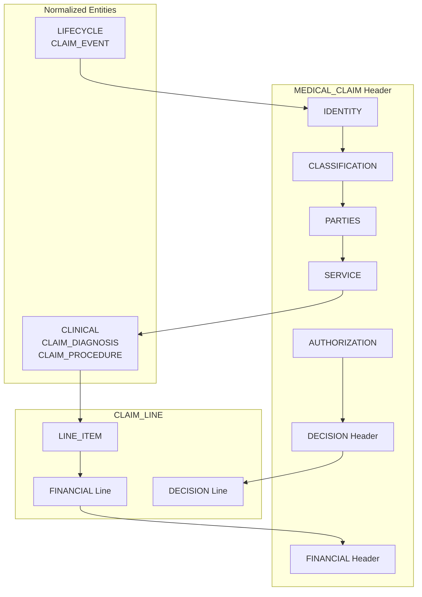

# EOB Attribute Domains Specification

## Overview

This document defines **Wellnecity-specific Attribute Domains** for organizing ExplanationOfBenefit (EOB) resource attributes. These domains provide a logical grouping structure that aligns with both FHIR R5 standards and Wellnecity's Enterprise Data Model (EDM).

**Version**: 1.0
**Created**: 2026-01-27
**FHIR Version**: R5 (v5.0.0)

---

## Domain Summary

| Domain | Purpose | FHIR R5 Mapping | Attributes | Level |
|--------|---------|-----------------|------------|-------|
| **IDENTITY** | Claim identification & tracking | `identifier`, `traceNumber` | 7 | Header/Line |
| **CLASSIFICATION** | Claim type & processing state | `status`, `type`, `use`, `outcome` | 6 | Header |
| **PARTIES** | Patient, providers, insurer | `patient`, `insurer`, `careTeam[]` | 10 | Header |
| **SERVICE** | Service dates & location | `billablePeriod`, `facility` | 8 | Header |
| **CLINICAL** | Diagnoses, procedures, DRG | `diagnosis[]`, `procedure[]` | 8 | Normalized |
| **LINE_ITEM** | Service line details | `item[]` | 12 | Line |
| **FINANCIAL** | Costs, payments, adjustments | `total[]`, `payment`, `adjudication[]` | 18 | Header/Line |
| **AUTHORIZATION** | Prior auth & funds reserve | `preAuthRef[]`, `fundsReserve` | 4 | Header |
| **DECISION** | Adjudication outcomes | `decision`, `disposition`, `reviewOutcome` | 6 | Header/Line |
| **LIFECYCLE** | Claim events & timestamps | `event[]`, `created` | 6 | Normalized |

**Total**: 85 attributes across 10 domains

---

## Domain Definitions

### 1. IDENTITY Domain

**Purpose**: Unique identifiers that trace the claim through internal and external systems.

**Business Value**: Enables claim traceability, audit trails, and cross-system reconciliation.

| Attribute | Type | FHIR R5 Element | EDM Field | Required | Description |
|-----------|------|-----------------|-----------|----------|-------------|
| `claim_id` | uuid | (internal) | `claim_id` | R | Wellnecity internal unique identifier |
| `claim_number` | string(50) | `identifier` | `claim_number` | R | Business identifier from source system |
| `trace_number` | string(100) | `traceNumber` | `trace_number` | | R5 tracking identifier for claim lifecycle |
| `source_claim_id` | string(100) | `claim` | `source_claim_id` | | Reference to original claim in source system |
| `adjudication_id` | uuid | `claimResponse` | `adjudication_id` | | FK to ADJUDICATION entity |
| `original_claim_id` | uuid | (extension) | `original_claim_id` | | Reference to original claim (for adjustments) |
| `line_trace_number` | string(100) | `item[].traceNumber` | `line_trace_number` | | R5 line-level tracking identifier |

**Validation Rules**:
- `claim_id` must be unique across all claims
- `claim_number` must be unique per source system
- `trace_number` should be unique per source system when populated

---

### 2. CLASSIFICATION Domain

**Purpose**: Categorization and processing state of the claim.

**Business Value**: Enables filtering, routing, and status tracking of claims.

| Attribute | Type | FHIR R5 Element | EDM Field | Required | Description |
|-----------|------|-----------------|-----------|----------|-------------|
| `claim_status` | string(30) | `status` | `claim_status` | R | Processing status (active, cancelled, draft, entered-in-error) |
| `claim_type` | string(30) | `type` | `claim_type` | R | Claim category (institutional, professional, oral, pharmacy, vision) |
| `claim_subtype` | string(30) | `subType` | `claim_subtype` | | Subcategory refinement |
| `claim_use` | string(30) | `use` | `claim_use` | R | Purpose (claim, preauthorization, predetermination) |
| `claim_outcome` | string(30) | `outcome` | `claim_outcome` | R | Processing outcome (queued, complete, error, partial) |
| `claim_form_type` | string(20) | (extension) | `claim_form_type` | | Form type (CMS1500, UB04) |

**Value Sets**:

| Attribute | Allowed Values |
|-----------|----------------|
| `claim_status` | active, cancelled, draft, entered-in-error |
| `claim_type` | institutional, professional, oral, pharmacy, vision |
| `claim_use` | claim, preauthorization, predetermination |
| `claim_outcome` | queued, complete, error, partial |
| `claim_form_type` | CMS1500, UB04 |

**Validation Rules**:
- `claim_status`, `claim_type`, `claim_use`, `claim_outcome` are FHIR R5 required fields
- Values must match FHIR R5 value sets

---

### 3. PARTIES Domain

**Purpose**: Identifies all entities involved in the claim transaction.

**Business Value**: Enables provider analytics, network analysis, and care team tracking.

| Attribute | Type | FHIR R5 Element | EDM Field | Required | Description |
|-----------|------|-----------------|-----------|----------|-------------|
| `member_id` | uuid | `patient` | `member_id` | R | FK to MEMBER - the patient |
| `employer_id` | uuid | (extension) | `employer_id` | R | FK to EMPLOYER |
| `insurer_id` | uuid | `insurer` | `insurer_id` | | FK to ORGANIZATION - the payer |
| `rendering_provider_id` | uuid | `provider` | `rendering_provider_id` | | FK to PROVIDER - performed service |
| `billing_provider_id` | uuid | `careTeam[role=billing]` | `billing_provider_id` | | FK to PROVIDER - submits claim |
| `referring_provider_id` | uuid | `careTeam[role=referring]` | `referring_provider_id` | | FK to PROVIDER - referral source |
| `attending_provider_id` | uuid | `careTeam[role=attending]` | `attending_provider_id` | | FK to PROVIDER - inpatient attending |
| `supervising_provider_id` | uuid | `careTeam[role=supervisor]` | `supervising_provider_id` | | FK to PROVIDER - supervising physician |
| `facility_id` | uuid | `facility` | `facility_id` | | FK to FACILITY - service location |
| `pharmacy_id` | uuid | (extension) | `pharmacy_id` | | FK to PHARMACY - for pharmacy claims |

**Care Team Role Mapping**:

| FHIR R5 careTeam.role | EDM Field |
|-----------------------|-----------|
| primary | `rendering_provider_id` |
| billing | `billing_provider_id` |
| referring | `referring_provider_id` |
| attending | `attending_provider_id` |
| supervisor | `supervising_provider_id` |

**Validation Rules**:
- `member_id` must reference valid MEMBER record
- `employer_id` must reference valid EMPLOYER record
- Provider IDs should reference valid PROVIDER records when populated

---

### 4. SERVICE Domain

**Purpose**: When and where services were rendered.

**Business Value**: Enables service date analysis, facility utilization, and claim sequencing.

| Attribute | Type | FHIR R5 Element | EDM Field | Required | Description |
|-----------|------|-----------------|-----------|----------|-------------|
| `service_date_from` | date | `billablePeriod.start` | `service_date_from` | R | Service period start date |
| `service_date_to` | date | `billablePeriod.end` | `service_date_to` | | Service period end date |
| `admission_date` | date | (extension) | `admission_date` | | Inpatient admission date |
| `discharge_date` | date | (extension) | `discharge_date` | | Inpatient discharge date |
| `received_date` | date | (extension) | `received_date` | | Date claim was received |
| `claim_precedence` | integer | `precedence` | `claim_precedence` | | R5 ordering for multiple EOBs |
| `place_of_service` | string(10) | `item[].locationCodeableConcept` | `place_of_service` | | Place of service code (header default) |
| `service_facility_npi` | string(10) | `facility.identifier` | `service_facility_npi` | | NPI of service facility |

**Validation Rules**:
- `service_date_from` is required
- `service_date_to` must be >= `service_date_from` when populated
- `discharge_date` must be >= `admission_date` when populated
- `claim_precedence` must be unique per member + date range

---

### 5. CLINICAL Domain

**Purpose**: Medical coding for diagnoses and procedures.

**Business Value**: Enables clinical analytics, DRG analysis, and quality measurement.

**Note**: This domain maps to normalized entities (CLAIM_DIAGNOSIS, CLAIM_PROCEDURE) rather than embedded fields.

| Attribute | Type | FHIR R5 Element | EDM Entity.Field | Required | Description |
|-----------|------|-----------------|------------------|----------|-------------|
| `diagnosis_sequence` | integer | `diagnosis[].sequence` | CLAIM_DIAGNOSIS.sequence | R | 1-based sequence number |
| `diagnosis_code` | string(10) | `diagnosis[].diagnosisCodeableConcept` | CLAIM_DIAGNOSIS.diagnosis_code | R | ICD-10-CM code |
| `diagnosis_type` | string(30) | `diagnosis[].type` | CLAIM_DIAGNOSIS.diagnosis_type | | admitting, principal, clinical, secondary |
| `poa_indicator` | string(5) | `diagnosis[].onAdmission` | CLAIM_DIAGNOSIS.poa_indicator | | Present on admission (Y, N, U, W, 1) |
| `procedure_sequence` | integer | `procedure[].sequence` | CLAIM_PROCEDURE.sequence | R | 1-based sequence number |
| `procedure_code` | string(10) | `procedure[].procedureCodeableConcept` | CLAIM_PROCEDURE.procedure_code | R | ICD-10-PCS code |
| `procedure_date` | date | `procedure[].date` | CLAIM_PROCEDURE.procedure_date | | Date procedure performed |
| `drg_code` | string(10) | `diagnosisRelatedGroup` | MEDICAL_CLAIM.drg_code | | DRG code (R5 first-class element) |

**Normalized Entities**:

```
CLAIMS.CLAIM_DIAGNOSIS (1:N from MEDICAL_CLAIM)
├── diagnosis_id (PK)
├── claim_id (FK)
├── sequence
├── diagnosis_code
├── diagnosis_type
├── poa_indicator
├── package_code
└── created_at, updated_at

CLAIMS.CLAIM_PROCEDURE (1:N from MEDICAL_CLAIM)
├── procedure_id (PK)
├── claim_id (FK)
├── sequence
├── procedure_code
├── procedure_code_type
├── procedure_date
├── udi_reference
└── created_at, updated_at
```

**Validation Rules**:
- Sequence numbers must be unique per claim and 1-based
- `diagnosis_code` must be valid ICD-10-CM
- `procedure_code` must be valid ICD-10-PCS or CPT/HCPCS
- Principal diagnosis (type = 'principal') should exist for institutional claims

---

### 6. LINE_ITEM Domain

**Purpose**: Service line-level details for billed services.

**Business Value**: Enables procedure-level analysis, unit cost calculation, and service mix reporting.

| Attribute | Type | FHIR R5 Element | EDM Field | Required | Description |
|-----------|------|-----------------|-----------|----------|-------------|
| `line_number` | integer | `item[].sequence` | `line_number` | R | Line sequence (1-based) |
| `cpt_code` | string(10) | `item[].productOrService` | `cpt_code` | | CPT/HCPCS procedure code |
| `procedure_code_end` | string(10) | `item[].productOrServiceEnd` | `procedure_code_end` | | R5 range endpoint for code ranges |
| `revenue_code` | string(4) | `item[].revenue` | `revenue_code` | | UB-04 revenue code |
| `cpt_modifier_1` | string(2) | `item[].modifier[0]` | `cpt_modifier_1` | | Modifier 1 |
| `cpt_modifier_2` | string(2) | `item[].modifier[1]` | `cpt_modifier_2` | | Modifier 2 |
| `cpt_modifier_3` | string(2) | `item[].modifier[2]` | `cpt_modifier_3` | | Modifier 3 |
| `cpt_modifier_4` | string(2) | `item[].modifier[3]` | `cpt_modifier_4` | | Modifier 4 |
| `service_date` | date | `item[].servicedDate` | `service_date` | | Line service date |
| `units` | decimal(10,2) | `item[].quantity` | `units` | | Service units/quantity |
| `unit_price` | decimal(12,4) | `item[].unitPrice` | `unit_price` | | Price per unit |
| `factor` | decimal(8,4) | `item[].factor` | `factor` | | Multiplier/discount factor |

**Validation Rules**:
- `line_number` must be unique per claim and >= 1
- `cpt_code` or `revenue_code` should be present
- `units` should be > 0 when populated
- `unit_price` should be >= 0 when populated

---

### 7. FINANCIAL Domain

**Purpose**: Monetary amounts including charges, payments, and cost sharing.

**Business Value**: Core financial reporting, cost analysis, and payment reconciliation.

#### Header-Level Financial Attributes

| Attribute | Type | FHIR R5 Element | EDM Field | Required | Description |
|-----------|------|-----------------|-----------|----------|-------------|
| `billed_amount` | decimal(12,2) | `total[submitted]` | `billed_amount` | | Total charges submitted |
| `allowed_amount` | decimal(12,2) | `total[eligible]` | `allowed_amount` | | Total eligible/allowed amount |
| `paid_amount` | decimal(12,2) | `total[benefit]` | `paid_amount` | | Total benefit paid |
| `deductible_amount` | decimal(12,2) | `total[deductible]` | `deductible_amount` | | Total deductible applied |
| `copay_amount` | decimal(12,2) | `total[copay]` | `copay_amount` | | Total copay applied |
| `coinsurance_amount` | decimal(12,2) | `total[coinsurance]` | `coinsurance_amount` | | Total coinsurance applied |
| `patient_paid_total` | decimal(12,2) | `patientPaid` | `patient_paid_total` | | R5 total patient responsibility |
| `cob_amount` | decimal(12,2) | `total[priorpayerpaid]` | `cob_amount` | | COB/other payer amount |
| `non_covered_amount` | decimal(12,2) | `total[noncovered]` | `non_covered_amount` | | Non-covered charges |
| `payment_type` | string(30) | `payment.type` | `payment_type` | | complete, partial |
| `payment_amount` | decimal(12,2) | `payment.amount` | `payment_amount` | | Actual payment amount |
| `paid_date` | date | `payment.date` | `paid_date` | | Payment date |
| `check_number` | string(50) | `payment.identifier` | `check_number` | | Payment/check identifier |

#### Line-Level Financial Attributes

| Attribute | Type | FHIR R5 Element | EDM Field | Required | Description |
|-----------|------|-----------------|-----------|----------|-------------|
| `line_billed_amount` | decimal(12,2) | `item[].net` | `billed_amount` | | Line charges |
| `line_allowed_amount` | decimal(12,2) | `item[].adjudication[eligible]` | `allowed_amount` | | Line allowed |
| `line_paid_amount` | decimal(12,2) | `item[].adjudication[benefit]` | `paid_amount` | | Line paid |
| `line_patient_paid` | decimal(12,2) | `item[].patientPaid` | `patient_paid_amount` | | R5 line patient paid |
| `line_tax_amount` | decimal(12,2) | `item[].tax` | `tax_amount` | | R5 line tax |

**Financial Hierarchy**:
```
MEDICAL_CLAIM (Header Totals)
├── billed_amount = SUM(CLAIM_LINE.billed_amount)
├── allowed_amount = SUM(CLAIM_LINE.allowed_amount)
├── paid_amount = SUM(CLAIM_LINE.paid_amount)
└── patient_paid_total = deductible + copay + coinsurance
```

**Validation Rules**:
- `allowed_amount` <= `billed_amount` (typically)
- `paid_amount` <= `allowed_amount` (typically)
- Header totals should equal sum of line amounts
- `claim_outcome` = 'complete' requires `paid_date` populated

---

### 8. AUTHORIZATION Domain

**Purpose**: Prior authorization references and fund reservation.

**Business Value**: Authorization tracking, utilization management, and compliance.

| Attribute | Type | FHIR R5 Element | EDM Field | Required | Description |
|-----------|------|-----------------|-----------|----------|-------------|
| `pre_auth_ref` | json | `preAuthRef[]` | `pre_auth_ref` | | Array of authorization reference numbers |
| `pre_auth_period_start` | date | `preAuthRefPeriod[].start` | `pre_auth_period_start` | | Authorization period start |
| `pre_auth_period_end` | date | `preAuthRefPeriod[].end` | `pre_auth_period_end` | | Authorization period end |
| `funds_reserve` | string(30) | `fundsReserve` | `funds_reserve` | | Funds reservation code |

**JSON Structure for `pre_auth_ref`**:
```json
[
  {
    "reference": "AUTH123456",
    "period_start": "2026-01-01",
    "period_end": "2026-03-31"
  }
]
```

**Validation Rules**:
- `pre_auth_period_end` must be >= `pre_auth_period_start` when populated
- Service dates should fall within authorization period

---

### 9. DECISION Domain

**Purpose**: Adjudication decisions and outcomes at header and line level.

**Business Value**: Denial analysis, appeals tracking, and adjudication quality.

| Attribute | Type | FHIR R5 Element | EDM Field | Required | Description |
|-----------|------|-----------------|-----------|----------|-------------|
| `decision` | string(30) | `decision` | `decision` | | Header decision (denied, partial, approved) |
| `disposition` | string(255) | `disposition` | `disposition` | | Human-readable status description |
| `denial_reason_code` | string(20) | `adjudication[].reason` | `denial_reason_code` | | Claim denial reason code |
| `denial_reason_desc` | string(255) | (lookup) | `denial_reason_desc` | | Denial reason description |
| `line_decision` | string(30) | `item[].reviewOutcome.decision` | `line_decision` | | R5 line-level decision |
| `line_decision_reason` | string(100) | `item[].reviewOutcome.reason` | `line_decision_reason` | | R5 line-level reason |

**Decision Value Set**:
| Value | Description |
|-------|-------------|
| `approved` | Claim fully approved |
| `partial` | Claim partially approved |
| `denied` | Claim denied |
| `pending` | Decision pending |

**Validation Rules**:
- `claim_outcome` = 'error' requires at least one denial reason
- `decision` = 'denied' requires `denial_reason_code`

---

### 10. LIFECYCLE Domain

**Purpose**: Claim lifecycle events and audit timestamps.

**Business Value**: Process timing analysis, SLA tracking, and audit compliance.

**Note**: Events are stored in normalized CLAIM_EVENT entity.

| Attribute | Type | FHIR R5 Element | EDM Entity.Field | Required | Description |
|-----------|------|-----------------|------------------|----------|-------------|
| `event_type` | string(30) | `event[].type` | CLAIM_EVENT.event_type | R | Event type code |
| `event_datetime` | datetime | `event[].when[x]` | CLAIM_EVENT.event_datetime | R | Event timestamp |
| `event_period_start` | datetime | `event[].when[x]` | CLAIM_EVENT.event_period_start | | Event period start |
| `event_period_end` | datetime | `event[].when[x]` | CLAIM_EVENT.event_period_end | | Event period end |
| `created_at` | datetime | `created` | MEDICAL_CLAIM.created_at | R | Record creation timestamp |
| `updated_at` | datetime | (meta) | MEDICAL_CLAIM.updated_at | R | Last update timestamp |

**Normalized Entity**:

```
CLAIMS.CLAIM_EVENT (1:N from MEDICAL_CLAIM)
├── event_id (PK)
├── claim_id (FK)
├── event_type
├── event_datetime
├── event_period_start
├── event_period_end
└── created_at, updated_at
```

**Event Type Value Set**:
| Event Type | Description |
|------------|-------------|
| `received` | Claim received by payer |
| `accepted` | Claim accepted for processing |
| `rejected` | Claim rejected (pre-adjudication) |
| `adjudicated` | Claim adjudication complete |
| `appealed` | Appeal submitted |
| `paid` | Payment issued |
| `voided` | Claim voided |

**Validation Rules**:
- `created_at` is required and immutable
- `updated_at` must be >= `created_at`
- Event sequence should follow logical order (received → adjudicated → paid)

---

## Domain Relationships



---

## Domain to EDM Entity Mapping

| Domain | Primary EDM Entity | Related Entities |
|--------|-------------------|------------------|
| IDENTITY | MEDICAL_CLAIM | CLAIM_LINE |
| CLASSIFICATION | MEDICAL_CLAIM | - |
| PARTIES | MEDICAL_CLAIM | MEMBER, EMPLOYER, PROVIDER, FACILITY |
| SERVICE | MEDICAL_CLAIM | ADMISSION |
| CLINICAL | CLAIM_DIAGNOSIS, CLAIM_PROCEDURE | ICD10_CODE, CPT_CODE |
| LINE_ITEM | CLAIM_LINE | CPT_CODE, REVENUE_CODE, MODIFIER_CODE |
| FINANCIAL | MEDICAL_CLAIM, CLAIM_LINE | ADJUDICATION |
| AUTHORIZATION | MEDICAL_CLAIM | - |
| DECISION | MEDICAL_CLAIM, CLAIM_LINE | - |
| LIFECYCLE | CLAIM_EVENT | - |

---

## Domain to FHIR R5 Element Mapping

| Domain | FHIR R5 Elements |
|--------|------------------|
| IDENTITY | `identifier`, `traceNumber`, `claim`, `claimResponse` |
| CLASSIFICATION | `status`, `type`, `subType`, `use`, `outcome` |
| PARTIES | `patient`, `insurer`, `provider`, `careTeam[]`, `facility` |
| SERVICE | `billablePeriod`, `precedence` |
| CLINICAL | `diagnosis[]`, `procedure[]`, `diagnosisRelatedGroup` |
| LINE_ITEM | `item[].sequence`, `item[].productOrService`, `item[].modifier[]`, `item[].quantity`, `item[].unitPrice` |
| FINANCIAL | `total[]`, `payment`, `patientPaid`, `item[].adjudication[]`, `item[].net`, `item[].tax` |
| AUTHORIZATION | `preAuthRef[]`, `preAuthRefPeriod[]`, `fundsReserve` |
| DECISION | `decision`, `disposition`, `item[].reviewOutcome` |
| LIFECYCLE | `event[]`, `created` |

---

## Implementation Notes

### Domain Loading Order

When loading EOB data, domains should be processed in this order:

1. **IDENTITY** - Establish claim identity first
2. **CLASSIFICATION** - Set claim type and status
3. **PARTIES** - Resolve member and provider references
4. **SERVICE** - Set service dates
5. **CLINICAL** - Load diagnoses and procedures (normalized)
6. **LINE_ITEM** - Load service lines
7. **FINANCIAL** - Calculate amounts (depends on lines)
8. **AUTHORIZATION** - Link authorizations
9. **DECISION** - Set adjudication outcomes
10. **LIFECYCLE** - Record events (append-only)

### Domain Validation Phases

| Phase | Domains Validated | Description |
|-------|-------------------|-------------|
| Pre-load | IDENTITY, CLASSIFICATION | Basic structure validation |
| Reference | PARTIES | FK validation to master data |
| Business | SERVICE, CLINICAL, LINE_ITEM | Business rule validation |
| Financial | FINANCIAL, AUTHORIZATION | Amount calculations and auth matching |
| Post-load | DECISION, LIFECYCLE | Outcome determination and event logging |

---

## Change Log

| Date | Version | Author | Changes |
|------|---------|--------|---------|
| 2026-01-27 | 1.0 | Data Architecture | Initial specification |
