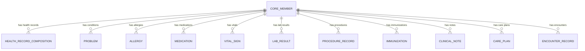
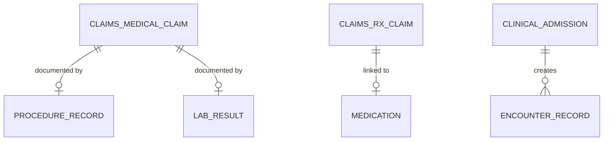
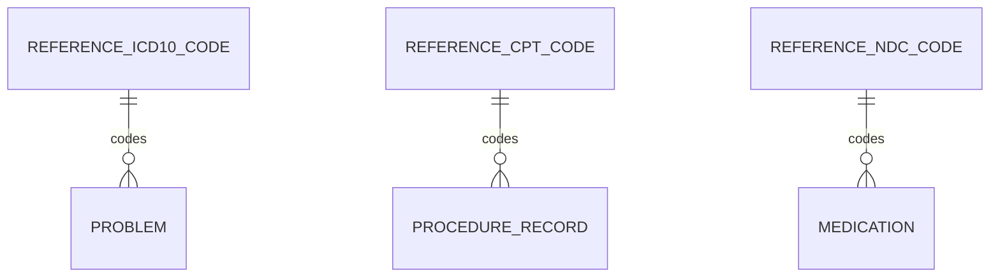

# HEALTH_RECORD TLD - Entity Specifications

## Overview

The HEALTH_RECORD Top Level Domain (TLD) implements a hybrid openEHR + FHIR architecture for comprehensive person health records. Data is stored using openEHR semantics for clinical precision and long-term persistence, with FHIR R4 mappings for interoperability.

### Architecture

```
Source Systems → openEHR Persistence (BigQuery) → FHIR Views (Interop)
```

### Design Principles

1. **openEHR Semantics**: Each entity maps to specific openEHR archetypes
2. **FHIR Interoperability**: BigQuery views expose FHIR R4-compliant structures
3. **Member-Centric**: All entities link to `CORE.MEMBER` via `member_id`
4. **Composition Pattern**: Clinical entries can be grouped into compositions
5. **Full Versioning**: Support for temporal queries and audit trails

---

## Conventions

### Data Types
| Type | Description |
|------|-------------|
| `string` | Variable-length text |
| `string(n)` | Fixed/max length text |
| `integer` | Whole numbers |
| `decimal(p,s)` | Precise decimals (precision, scale) |
| `date` | Date without time (YYYY-MM-DD) |
| `datetime` | Date with time (ISO 8601) |
| `timestamp` | Alias for datetime |
| `boolean` | True/False |
| `uuid` | Universally unique identifier |
| `json` | JSON object/array |

### Column Notation
| Symbol | Meaning |
|--------|---------|
| **PK** | Primary Key |
| **FK** | Foreign Key |
| **U** | Unique |
| **R** | Required (NOT NULL) |
| **I** | Indexed |

### Naming Standards
- Entity names: `UPPER_SNAKE_CASE`
- Field names: `lower_snake_case`
- Foreign keys: `<entity>_id`
- Timestamps: `created_at`, `updated_at`

---

## Entity Inventory

| # | Entity | openEHR Archetype | FHIR Resource | Fields |
|---|--------|-------------------|---------------|--------|
| 1 | HEALTH_RECORD_COMPOSITION | COMPOSITION | Bundle | 24 |
| 2 | PROBLEM | EVALUATION.problem_diagnosis | Condition | 26 |
| 3 | ALLERGY | EVALUATION.adverse_reaction_risk | AllergyIntolerance | 28 |
| 4 | MEDICATION | INSTRUCTION.medication_order | MedicationRequest/Statement | 35 |
| 5 | VITAL_SIGN | OBSERVATION.* (vitals) | Observation (vital-signs) | 26 |
| 6 | LAB_RESULT | OBSERVATION.laboratory_test_result | Observation (laboratory) | 30 |
| 7 | PROCEDURE_RECORD | ACTION.procedure | Procedure | 28 |
| 8 | IMMUNIZATION | ACTION.immunisation | Immunization | 26 |
| 9 | CLINICAL_NOTE | COMPOSITION.report | DocumentReference | 22 |
| 10 | CARE_PLAN | INSTRUCTION.care_plan | CarePlan | 24 |
| 11 | ENCOUNTER_RECORD | COMPOSITION.encounter | Encounter | 28 |
| 12 | HEALTH_RECORD_PROVENANCE | RM.AUDIT_DETAILS | Provenance | 18 |

**Total Fields**: ~315

---

# Entity: HEALTH_RECORD_COMPOSITION

Container that groups related clinical entries following the openEHR COMPOSITION pattern. Each composition represents a clinical document or collection of related observations.

**openEHR Mapping**: `COMPOSITION` class
**FHIR Mapping**: `Bundle` (type: document) or `Composition`

| Field | Type | Constraints | Description |
|-------|------|-------------|-------------|
| `composition_id` | uuid | PK, R | Unique identifier |
| `member_id` | uuid | FK, R, I | Reference to CORE.MEMBER |
| `employer_id` | uuid | FK, R, I | Reference to CORE.EMPLOYER |
| `archetype_id` | string(255) | R | openEHR archetype ID (e.g., openEHR-EHR-COMPOSITION.encounter.v1) |
| `template_id` | string(255) | | Template ID if using operational template |
| `composition_type` | string(50) | R, I | Type: ENCOUNTER, DISCHARGE_SUMMARY, PROBLEM_LIST, MEDICATION_LIST, LAB_REPORT, VITAL_SIGNS |
| `category` | string(50) | R | openEHR category: EVENT, PERSISTENT, EPISODIC |
| `context_start_time` | datetime | R | Start time of clinical context |
| `context_end_time` | datetime | | End time of context |
| `context_setting` | string(100) | | Care setting code (home, primary_care, emergency, inpatient, etc.) |
| `context_location` | string(255) | | Location of care |
| `composer_id` | string(100) | | Author/composer identifier |
| `composer_name` | string(255) | | Author name |
| `language` | string(10) | | Language code (ISO 639-1) |
| `territory` | string(10) | | Territory code (ISO 3166-1) |
| `version_number` | integer | R | Version of this composition (starts at 1) |
| `is_current` | boolean | R | True if this is the current version |
| `preceding_version_id` | uuid | FK | Reference to previous version |
| `status` | string(30) | R | ACTIVE, SUPERSEDED, DELETED |
| `fhir_bundle_id` | string(100) | I | FHIR Bundle identifier for mapping |
| `source` | string(50) | | Source system |
| `source_id` | string(100) | | Source record ID |
| `created_at` | datetime | R | Record creation timestamp |
| `updated_at` | datetime | R | Last update timestamp |

**Relationships**:
- HEALTH_RECORD_COMPOSITION N:1 MEMBER (belongs to)
- HEALTH_RECORD_COMPOSITION 1:N PROBLEM (contains)
- HEALTH_RECORD_COMPOSITION 1:N ALLERGY (contains)
- HEALTH_RECORD_COMPOSITION 1:N MEDICATION (contains)
- HEALTH_RECORD_COMPOSITION 1:N VITAL_SIGN (contains)
- HEALTH_RECORD_COMPOSITION 1:N LAB_RESULT (contains)
- HEALTH_RECORD_COMPOSITION 1:N PROCEDURE_RECORD (contains)

**Indexes**:
- `idx_composition_member` (member_id)
- `idx_composition_type` (composition_type)
- `idx_composition_context_time` (context_start_time)

---

# Entity: PROBLEM

Diagnoses, health problems, and clinical conditions. Supports both active problem lists and historical diagnoses.

**openEHR Mapping**: `openEHR-EHR-EVALUATION.problem_diagnosis.v1`
**FHIR Mapping**: `Condition`

| Field | Type | Constraints | Description |
|-------|------|-------------|-------------|
| `problem_id` | uuid | PK, R | Unique identifier |
| `composition_id` | uuid | FK, I | Parent composition (optional) |
| `member_id` | uuid | FK, R, I | Reference to CORE.MEMBER |
| `archetype_id` | string(255) | R | openEHR archetype ID |
| `problem_name` | string(500) | R | Problem/diagnosis name (text) |
| `problem_code` | string(20) | I | ICD-10-CM or SNOMED CT code |
| `problem_code_system` | string(100) | | Code system URI (http://hl7.org/fhir/sid/icd-10-cm) |
| `problem_code_display` | string(500) | | Code display text |
| `clinical_status` | string(30) | R, I | active, recurrence, relapse, inactive, remission, resolved |
| `verification_status` | string(30) | | unconfirmed, provisional, differential, confirmed, refuted, entered-in-error |
| `category` | string(50) | | problem-list-item, encounter-diagnosis, health-concern |
| `severity` | string(30) | | mild, moderate, severe |
| `body_site` | string(255) | | Anatomical location |
| `body_site_code` | string(20) | | SNOMED body site code |
| `onset_date` | date | | Date of onset |
| `onset_age` | string(50) | | Age at onset (e.g., "45 years") |
| `abatement_date` | date | | Date resolved/inactive |
| `recorded_date` | datetime | R | When recorded in system |
| `recorder_id` | string(100) | | Who recorded (practitioner ID) |
| `asserter_id` | string(100) | | Who asserted the condition |
| `encounter_id` | uuid | FK, I | Related encounter |
| `clinical_note` | string | | Additional clinical notes |
| `fhir_condition_id` | string(100) | I | FHIR Condition identifier |
| `source` | string(50) | | Source system |
| `source_id` | string(100) | | Source record ID |
| `created_at` | datetime | R | Record creation timestamp |
| `updated_at` | datetime | R | Last update timestamp |

**Relationships**:
- PROBLEM N:1 MEMBER (belongs to)
- PROBLEM N:1 HEALTH_RECORD_COMPOSITION (part of)
- PROBLEM N:1 ENCOUNTER_RECORD (diagnosed during)
- PROBLEM N:1 REFERENCE.ICD10_CODE (coded by)

**Business Rules**:
- clinical_status is required and must be from defined value set
- onset_date should be <= recorded_date
- abatement_date should be >= onset_date when present

**Indexes**:
- `idx_problem_member` (member_id)
- `idx_problem_clinical_status` (clinical_status)
- `idx_problem_code` (problem_code)
- `idx_problem_recorded_date` (recorded_date)

---

# Entity: ALLERGY

Allergies, intolerances, and adverse reaction risks. Records clinical assessment of potential risk upon exposure to substances.

**openEHR Mapping**: `openEHR-EHR-EVALUATION.adverse_reaction_risk.v1`
**FHIR Mapping**: `AllergyIntolerance`

| Field | Type | Constraints | Description |
|-------|------|-------------|-------------|
| `allergy_id` | uuid | PK, R | Unique identifier |
| `composition_id` | uuid | FK, I | Parent composition (optional) |
| `member_id` | uuid | FK, R, I | Reference to CORE.MEMBER |
| `archetype_id` | string(255) | R | openEHR archetype ID |
| `substance_name` | string(255) | R | Causative agent name |
| `substance_code` | string(50) | I | RxNorm, SNOMED, or UNII code |
| `substance_code_system` | string(100) | | Code system URI |
| `substance_code_display` | string(255) | | Code display text |
| `category` | string(30) | | food, medication, environment, biologic |
| `allergy_type` | string(30) | | allergy, intolerance |
| `criticality` | string(20) | | low, high, unable-to-assess |
| `clinical_status` | string(30) | R, I | active, inactive, resolved |
| `verification_status` | string(30) | | unconfirmed, presumed, confirmed, refuted, entered-in-error |
| `onset_date` | date | | When allergy began |
| `recorded_date` | datetime | R | When recorded in system |
| `recorder_id` | string(100) | | Who recorded |
| `asserter_id` | string(100) | | Who asserted |
| `last_occurrence` | date | | Date of last reaction |
| `reaction_manifestation` | json | | Array of manifestation codes/descriptions |
| `reaction_severity` | string(20) | | mild, moderate, severe |
| `reaction_onset` | string(50) | | Onset timing of reaction |
| `reaction_description` | string | | Narrative description of reaction |
| `reaction_exposure_route` | string(100) | | Route of exposure |
| `clinical_note` | string | | Additional notes |
| `fhir_allergy_id` | string(100) | I | FHIR AllergyIntolerance identifier |
| `source` | string(50) | | Source system |
| `source_id` | string(100) | | Source record ID |
| `created_at` | datetime | R | Record creation timestamp |
| `updated_at` | datetime | R | Last update timestamp |

**Relationships**:
- ALLERGY N:1 MEMBER (belongs to)
- ALLERGY N:1 HEALTH_RECORD_COMPOSITION (part of)

**Business Rules**:
- clinical_status is required
- criticality should be "high" for life-threatening reactions
- reaction_manifestation is JSON array of {code, system, display, text}

**Indexes**:
- `idx_allergy_member` (member_id)
- `idx_allergy_clinical_status` (clinical_status)
- `idx_allergy_substance_code` (substance_code)
- `idx_allergy_category` (category)

---

# Entity: MEDICATION

Medication orders, prescriptions, and administration records. Supports both INSTRUCTION (what should happen) and ACTION (what was done) patterns.

**openEHR Mapping**: `openEHR-EHR-INSTRUCTION.medication_order.v3`, `openEHR-EHR-ACTION.medication.v1`
**FHIR Mapping**: `MedicationRequest`, `MedicationStatement`

| Field | Type | Constraints | Description |
|-------|------|-------------|-------------|
| `medication_id` | uuid | PK, R | Unique identifier |
| `composition_id` | uuid | FK, I | Parent composition (optional) |
| `member_id` | uuid | FK, R, I | Reference to CORE.MEMBER |
| `archetype_id` | string(255) | R | openEHR archetype ID |
| `entry_type` | string(30) | R, I | INSTRUCTION (order) or ACTION (administration) |
| `medication_name` | string(500) | R | Medication name (generic or brand) |
| `medication_code` | string(20) | I | NDC or RxNorm code |
| `medication_code_system` | string(100) | | Code system URI |
| `medication_code_display` | string(500) | | Code display text |
| `status` | string(30) | R, I | active, completed, cancelled, stopped, on-hold, draft, entered-in-error |
| `intent` | string(30) | | order, plan, proposal, instance-order |
| `category` | string(50) | | inpatient, outpatient, community, discharge |
| `dosage_text` | string(500) | | Free-text dosage instructions |
| `dose_quantity` | decimal(10,4) | | Dose amount |
| `dose_unit` | string(50) | | Dose unit (mg, ml, tablet, etc.) |
| `route` | string(100) | | Administration route (oral, IV, topical, etc.) |
| `route_code` | string(20) | | SNOMED route code |
| `frequency_text` | string(100) | | Frequency description (BID, TID, PRN) |
| `frequency_period` | decimal(5,2) | | Frequency period value |
| `frequency_period_unit` | string(20) | | Frequency period unit (h, d, wk) |
| `as_needed` | boolean | | PRN flag |
| `as_needed_reason` | string(255) | | PRN reason |
| `start_date` | date | | Medication start date |
| `end_date` | date | | Medication end date |
| `authored_on` | datetime | R | When prescribed/ordered |
| `prescriber_id` | string(100) | | Prescriber NPI or identifier |
| `prescriber_name` | string(255) | | Prescriber name |
| `dispense_quantity` | decimal(10,2) | | Quantity to dispense |
| `dispense_unit` | string(50) | | Dispense unit |
| `refills_allowed` | integer | | Number of refills |
| `substitution_allowed` | boolean | | Generic substitution allowed |
| `reason_code` | string(20) | | Reason for medication (ICD-10) |
| `reason_text` | string(500) | | Reason description |
| `clinical_note` | string | | Additional notes |
| `fhir_medication_id` | string(100) | I | FHIR MedicationRequest identifier |
| `rx_claim_id` | uuid | FK, I | Link to CLAIMS.RX_CLAIM |
| `source` | string(50) | | Source system |
| `source_id` | string(100) | | Source record ID |
| `created_at` | datetime | R | Record creation timestamp |
| `updated_at` | datetime | R | Last update timestamp |

**Relationships**:
- MEDICATION N:1 MEMBER (belongs to)
- MEDICATION N:1 HEALTH_RECORD_COMPOSITION (part of)
- MEDICATION N:1 CLAIMS.RX_CLAIM (linked to)
- MEDICATION N:1 REFERENCE.NDC_CODE (coded by)

**Business Rules**:
- entry_type determines openEHR archetype mapping
- status values differ between INSTRUCTION and ACTION entries
- authored_on is required for all medication records

**Indexes**:
- `idx_medication_member` (member_id)
- `idx_medication_status` (status)
- `idx_medication_code` (medication_code)
- `idx_medication_entry_type` (entry_type)
- `idx_medication_authored` (authored_on)

---

# Entity: VITAL_SIGN

Vital sign observations including blood pressure, pulse, temperature, respiratory rate, oxygen saturation, height, weight, and BMI.

**openEHR Mapping**: Multiple OBSERVATION archetypes:
- `openEHR-EHR-OBSERVATION.blood_pressure.v2`
- `openEHR-EHR-OBSERVATION.pulse.v2`
- `openEHR-EHR-OBSERVATION.body_temperature.v2`
- `openEHR-EHR-OBSERVATION.respiration.v2`
- `openEHR-EHR-OBSERVATION.pulse_oximetry.v1`
- `openEHR-EHR-OBSERVATION.height.v2`
- `openEHR-EHR-OBSERVATION.body_weight.v2`
- `openEHR-EHR-OBSERVATION.body_mass_index.v2`

**FHIR Mapping**: `Observation` (category: vital-signs)

| Field | Type | Constraints | Description |
|-------|------|-------------|-------------|
| `vital_sign_id` | uuid | PK, R | Unique identifier |
| `composition_id` | uuid | FK, I | Parent composition (optional) |
| `member_id` | uuid | FK, R, I | Reference to CORE.MEMBER |
| `archetype_id` | string(255) | R | openEHR archetype ID |
| `vital_type` | string(50) | R, I | BLOOD_PRESSURE, PULSE, TEMPERATURE, RESPIRATORY_RATE, OXYGEN_SATURATION, HEIGHT, WEIGHT, BMI |
| `vital_code` | string(20) | | LOINC code |
| `vital_code_system` | string(100) | | Code system (http://loinc.org) |
| `vital_code_display` | string(255) | | Code display text |
| `status` | string(30) | R | registered, preliminary, final, amended, corrected, cancelled, entered-in-error |
| `effective_datetime` | datetime | R | When measured |
| `value_quantity` | decimal(10,4) | | Primary numeric value |
| `value_unit` | string(30) | | Unit of measure |
| `value_systolic` | decimal(5,1) | | Systolic BP (mmHg) |
| `value_diastolic` | decimal(5,1) | | Diastolic BP (mmHg) |
| `value_text` | string(255) | | Text value if non-numeric |
| `interpretation` | string(50) | | N (normal), H (high), L (low), HH, LL, etc. |
| `body_site` | string(100) | | Body site of measurement |
| `body_site_code` | string(20) | | SNOMED body site code |
| `method` | string(100) | | Method of measurement |
| `device` | string(255) | | Device used |
| `performer_id` | string(100) | | Who performed measurement |
| `performer_name` | string(255) | | Performer name |
| `encounter_id` | uuid | FK, I | Related encounter |
| `clinical_note` | string | | Additional notes |
| `fhir_observation_id` | string(100) | I | FHIR Observation identifier |
| `source` | string(50) | | Source system |
| `source_id` | string(100) | | Source record ID |
| `created_at` | datetime | R | Record creation timestamp |
| `updated_at` | datetime | R | Last update timestamp |

**LOINC Codes by Vital Type**:
| Vital Type | LOINC Code | Display |
|------------|------------|---------|
| BLOOD_PRESSURE | 85354-9 | Blood pressure panel |
| PULSE | 8867-4 | Heart rate |
| TEMPERATURE | 8310-5 | Body temperature |
| RESPIRATORY_RATE | 9279-1 | Respiratory rate |
| OXYGEN_SATURATION | 2708-6 | Oxygen saturation |
| HEIGHT | 8302-2 | Body height |
| WEIGHT | 29463-7 | Body weight |
| BMI | 39156-5 | Body mass index |

**Relationships**:
- VITAL_SIGN N:1 MEMBER (belongs to)
- VITAL_SIGN N:1 HEALTH_RECORD_COMPOSITION (part of)
- VITAL_SIGN N:1 ENCOUNTER_RECORD (recorded during)

**Business Rules**:
- For BLOOD_PRESSURE, use value_systolic and value_diastolic fields
- For other vitals, use value_quantity and value_unit
- effective_datetime is required for all observations

**Indexes**:
- `idx_vital_member` (member_id)
- `idx_vital_type` (vital_type)
- `idx_vital_effective` (effective_datetime)
- `idx_vital_status` (status)

---

# Entity: LAB_RESULT

Laboratory test results and diagnostic observations.

**openEHR Mapping**: `openEHR-EHR-OBSERVATION.laboratory_test_result.v1`, `openEHR-EHR-CLUSTER.laboratory_test_analyte.v1`
**FHIR Mapping**: `Observation` (category: laboratory), `DiagnosticReport`

| Field | Type | Constraints | Description |
|-------|------|-------------|-------------|
| `lab_result_id` | uuid | PK, R | Unique identifier |
| `composition_id` | uuid | FK, I | Parent composition (optional) |
| `member_id` | uuid | FK, R, I | Reference to CORE.MEMBER |
| `diagnostic_report_id` | uuid | FK, I | Parent DiagnosticReport (for panel results) |
| `archetype_id` | string(255) | R | openEHR archetype ID |
| `test_name` | string(500) | R | Test name |
| `test_code` | string(20) | I | LOINC code |
| `test_code_system` | string(100) | | Code system URI |
| `test_code_display` | string(500) | | Code display text |
| `category` | string(50) | | Laboratory category (chemistry, hematology, microbiology, etc.) |
| `status` | string(30) | R, I | registered, preliminary, final, amended, corrected, cancelled, entered-in-error |
| `effective_datetime` | datetime | R | Specimen collection time |
| `issued` | datetime | | Result issue time |
| `value_quantity` | decimal(15,6) | | Numeric result value |
| `value_unit` | string(50) | | Result unit |
| `value_string` | string(1000) | | String result |
| `value_codeable_concept` | string(100) | | Coded result |
| `value_codeable_system` | string(100) | | Coded result system |
| `reference_range_low` | decimal(15,6) | | Low normal value |
| `reference_range_high` | decimal(15,6) | | High normal value |
| `reference_range_text` | string(255) | | Reference range as text |
| `interpretation` | string(50) | | N, H, L, HH, LL, A (abnormal), AA, etc. |
| `specimen_type` | string(100) | | Specimen type (blood, urine, etc.) |
| `specimen_code` | string(20) | | SNOMED specimen code |
| `performing_lab` | string(255) | | Performing laboratory name |
| `performing_lab_id` | string(100) | | Lab identifier (CLIA, etc.) |
| `ordering_provider_id` | string(100) | | Ordering provider NPI |
| `encounter_id` | uuid | FK, I | Related encounter |
| `clinical_note` | string | | Comments/notes |
| `fhir_observation_id` | string(100) | I | FHIR Observation identifier |
| `medical_claim_id` | uuid | FK, I | Link to CLAIMS.MEDICAL_CLAIM |
| `source` | string(50) | | Source system |
| `source_id` | string(100) | | Source record ID |
| `created_at` | datetime | R | Record creation timestamp |
| `updated_at` | datetime | R | Last update timestamp |

**Relationships**:
- LAB_RESULT N:1 MEMBER (belongs to)
- LAB_RESULT N:1 HEALTH_RECORD_COMPOSITION (part of)
- LAB_RESULT N:1 LAB_RESULT (part of panel via diagnostic_report_id)
- LAB_RESULT N:1 CLAIMS.MEDICAL_CLAIM (linked to)

**Business Rules**:
- Use value_quantity for numeric results, value_string for text results
- effective_datetime represents specimen collection time
- issued represents when result was available

**Indexes**:
- `idx_lab_member` (member_id)
- `idx_lab_test_code` (test_code)
- `idx_lab_effective` (effective_datetime)
- `idx_lab_status` (status)
- `idx_lab_diagnostic_report` (diagnostic_report_id)

---

# Entity: PROCEDURE_RECORD

Clinical procedures performed on the patient.

**openEHR Mapping**: `openEHR-EHR-ACTION.procedure.v1`
**FHIR Mapping**: `Procedure`

| Field | Type | Constraints | Description |
|-------|------|-------------|-------------|
| `procedure_record_id` | uuid | PK, R | Unique identifier |
| `composition_id` | uuid | FK, I | Parent composition (optional) |
| `member_id` | uuid | FK, R, I | Reference to CORE.MEMBER |
| `archetype_id` | string(255) | R | openEHR archetype ID |
| `procedure_name` | string(500) | R | Procedure name |
| `procedure_code` | string(20) | I | CPT, SNOMED, or ICD-10-PCS code |
| `procedure_code_system` | string(100) | | Code system URI |
| `procedure_code_display` | string(500) | | Code display text |
| `status` | string(30) | R, I | preparation, in-progress, not-done, on-hold, stopped, completed, entered-in-error, unknown |
| `status_reason` | string(255) | | Reason for status (especially if not-done) |
| `category` | string(50) | | Procedure category |
| `performed_datetime` | datetime | | When performed (point in time) |
| `performed_period_start` | datetime | | Start of procedure |
| `performed_period_end` | datetime | | End of procedure |
| `body_site` | string(255) | | Body site |
| `body_site_code` | string(20) | | SNOMED body site code |
| `laterality` | string(20) | | left, right, bilateral |
| `performer_id` | string(100) | | Primary performer NPI |
| `performer_name` | string(255) | | Performer name |
| `performer_role` | string(100) | | Performer role (surgeon, assistant, etc.) |
| `location_id` | string(100) | | Where performed |
| `location_name` | string(255) | | Location name |
| `encounter_id` | uuid | FK, I | Related encounter |
| `reason_code` | string(20) | | Reason code (ICD-10) |
| `reason_text` | string(500) | | Reason description |
| `outcome` | string(255) | | Procedure outcome |
| `complication` | string(500) | | Complications |
| `clinical_note` | string | | Additional notes |
| `fhir_procedure_id` | string(100) | I | FHIR Procedure identifier |
| `medical_claim_id` | uuid | FK, I | Link to CLAIMS.MEDICAL_CLAIM |
| `source` | string(50) | | Source system |
| `source_id` | string(100) | | Source record ID |
| `created_at` | datetime | R | Record creation timestamp |
| `updated_at` | datetime | R | Last update timestamp |

**Relationships**:
- PROCEDURE_RECORD N:1 MEMBER (belongs to)
- PROCEDURE_RECORD N:1 HEALTH_RECORD_COMPOSITION (part of)
- PROCEDURE_RECORD N:1 ENCOUNTER_RECORD (performed during)
- PROCEDURE_RECORD N:1 CLAIMS.MEDICAL_CLAIM (linked to)
- PROCEDURE_RECORD N:1 REFERENCE.CPT_CODE (coded by)

**Indexes**:
- `idx_procedure_member` (member_id)
- `idx_procedure_code` (procedure_code)
- `idx_procedure_performed` (performed_datetime)
- `idx_procedure_status` (status)

---

# Entity: IMMUNIZATION

Vaccination and immunization records.

**openEHR Mapping**: `openEHR-EHR-ACTION.immunisation.v1`
**FHIR Mapping**: `Immunization`

| Field | Type | Constraints | Description |
|-------|------|-------------|-------------|
| `immunization_id` | uuid | PK, R | Unique identifier |
| `composition_id` | uuid | FK, I | Parent composition (optional) |
| `member_id` | uuid | FK, R, I | Reference to CORE.MEMBER |
| `archetype_id` | string(255) | R | openEHR archetype ID |
| `vaccine_name` | string(500) | R | Vaccine product name |
| `vaccine_code` | string(20) | I | CVX code |
| `vaccine_code_system` | string(100) | | Code system (http://hl7.org/fhir/sid/cvx) |
| `vaccine_code_display` | string(500) | | Code display text |
| `status` | string(30) | R, I | completed, entered-in-error, not-done |
| `status_reason` | string(255) | | Reason if not-done |
| `occurrence_datetime` | datetime | R | When administered |
| `recorded_date` | datetime | | When recorded in system |
| `primary_source` | boolean | | True if from administering provider |
| `report_origin` | string(100) | | Source of reported immunization |
| `lot_number` | string(50) | | Vaccine lot number |
| `expiration_date` | date | | Vaccine expiration date |
| `site` | string(100) | | Body site of administration |
| `site_code` | string(20) | | SNOMED site code |
| `route` | string(100) | | Administration route |
| `route_code` | string(20) | | SNOMED route code |
| `dose_quantity` | decimal(10,4) | | Dose amount |
| `dose_unit` | string(50) | | Dose unit |
| `performer_id` | string(100) | | Administering provider |
| `performer_name` | string(255) | | Provider name |
| `location_id` | string(100) | | Administration location |
| `encounter_id` | uuid | FK, I | Related encounter |
| `clinical_note` | string | | Additional notes |
| `fhir_immunization_id` | string(100) | I | FHIR Immunization identifier |
| `source` | string(50) | | Source system |
| `source_id` | string(100) | | Source record ID |
| `created_at` | datetime | R | Record creation timestamp |
| `updated_at` | datetime | R | Last update timestamp |

**Relationships**:
- IMMUNIZATION N:1 MEMBER (belongs to)
- IMMUNIZATION N:1 HEALTH_RECORD_COMPOSITION (part of)
- IMMUNIZATION N:1 ENCOUNTER_RECORD (administered during)

**Indexes**:
- `idx_immunization_member` (member_id)
- `idx_immunization_vaccine_code` (vaccine_code)
- `idx_immunization_occurrence` (occurrence_datetime)
- `idx_immunization_status` (status)

---

# Entity: CLINICAL_NOTE

Clinical narratives, summaries, and documentation.

**openEHR Mapping**: `openEHR-EHR-COMPOSITION.report.v1`, `openEHR-EHR-EVALUATION.clinical_synopsis.v1`
**FHIR Mapping**: `DocumentReference`

| Field | Type | Constraints | Description |
|-------|------|-------------|-------------|
| `clinical_note_id` | uuid | PK, R | Unique identifier |
| `composition_id` | uuid | FK, I | Parent composition (optional) |
| `member_id` | uuid | FK, R, I | Reference to CORE.MEMBER |
| `archetype_id` | string(255) | R | openEHR archetype ID |
| `document_type` | string(50) | R, I | progress_note, discharge_summary, consultation, history_physical, procedure_note, etc. |
| `document_type_code` | string(20) | | LOINC document type code |
| `document_status` | string(30) | R | current, superseded, entered-in-error |
| `doc_status` | string(30) | | preliminary, final, amended, corrected |
| `title` | string(500) | | Document title |
| `content_text` | string | | Plain text content |
| `content_format` | string(50) | | text/plain, text/html, application/pdf |
| `content_url` | string(1000) | | URL to document content |
| `content_size` | integer | | Content size in bytes |
| `content_hash` | string(64) | | SHA-256 hash of content |
| `created_datetime` | datetime | R | When document was created |
| `author_id` | string(100) | | Author identifier |
| `author_name` | string(255) | | Author name |
| `authenticator_id` | string(100) | | Authenticator/signer |
| `custodian_id` | string(100) | | Custodian organization |
| `encounter_id` | uuid | FK, I | Related encounter |
| `clinical_context` | string(255) | | Clinical context |
| `fhir_document_id` | string(100) | I | FHIR DocumentReference identifier |
| `source` | string(50) | | Source system |
| `source_id` | string(100) | | Source record ID |
| `created_at` | datetime | R | Record creation timestamp |
| `updated_at` | datetime | R | Last update timestamp |

**Relationships**:
- CLINICAL_NOTE N:1 MEMBER (belongs to)
- CLINICAL_NOTE N:1 HEALTH_RECORD_COMPOSITION (part of)
- CLINICAL_NOTE N:1 ENCOUNTER_RECORD (documented during)

**Indexes**:
- `idx_note_member` (member_id)
- `idx_note_document_type` (document_type)
- `idx_note_created` (created_datetime)
- `idx_note_status` (document_status)

---

# Entity: CARE_PLAN

Care plans, treatment plans, and goals.

**openEHR Mapping**: `openEHR-EHR-INSTRUCTION.care_plan.v1`
**FHIR Mapping**: `CarePlan`

| Field | Type | Constraints | Description |
|-------|------|-------------|-------------|
| `care_plan_id` | uuid | PK, R | Unique identifier |
| `composition_id` | uuid | FK, I | Parent composition (optional) |
| `member_id` | uuid | FK, R, I | Reference to CORE.MEMBER |
| `archetype_id` | string(255) | R | openEHR archetype ID |
| `plan_title` | string(500) | R | Care plan title |
| `plan_description` | string | | Plan description |
| `status` | string(30) | R, I | draft, active, on-hold, revoked, completed, entered-in-error, unknown |
| `intent` | string(30) | R | proposal, plan, order, option |
| `category` | string(50) | | assess-plan, discharge, longitudinal, etc. |
| `period_start` | date | | Plan start date |
| `period_end` | date | | Plan end date |
| `created_datetime` | datetime | R | When plan was created |
| `author_id` | string(100) | | Author identifier |
| `author_name` | string(255) | | Author name |
| `contributor_ids` | json | | Array of contributor identifiers |
| `addresses_conditions` | json | | Array of condition IDs this plan addresses |
| `goals` | json | | Array of goal descriptions |
| `activities` | json | | Array of planned activities |
| `encounter_id` | uuid | FK, I | Related encounter |
| `clinical_note` | string | | Additional notes |
| `fhir_careplan_id` | string(100) | I | FHIR CarePlan identifier |
| `source` | string(50) | | Source system |
| `source_id` | string(100) | | Source record ID |
| `created_at` | datetime | R | Record creation timestamp |
| `updated_at` | datetime | R | Last update timestamp |

**Relationships**:
- CARE_PLAN N:1 MEMBER (belongs to)
- CARE_PLAN N:1 HEALTH_RECORD_COMPOSITION (part of)
- CARE_PLAN N:M PROBLEM (addresses)

**Indexes**:
- `idx_careplan_member` (member_id)
- `idx_careplan_status` (status)
- `idx_careplan_period` (period_start, period_end)

---

# Entity: ENCOUNTER_RECORD

Clinical encounters, visits, and admissions.

**openEHR Mapping**: `openEHR-EHR-COMPOSITION.encounter.v1`
**FHIR Mapping**: `Encounter`

| Field | Type | Constraints | Description |
|-------|------|-------------|-------------|
| `encounter_id` | uuid | PK, R | Unique identifier |
| `composition_id` | uuid | FK, I | Parent composition (if exists) |
| `member_id` | uuid | FK, R, I | Reference to CORE.MEMBER |
| `archetype_id` | string(255) | R | openEHR archetype ID |
| `encounter_class` | string(30) | R, I | ambulatory, emergency, field, home, inpatient, short-stay, virtual |
| `encounter_class_code` | string(20) | | ActCode system code |
| `encounter_type` | string(100) | | Specific encounter type |
| `encounter_type_code` | string(20) | | SNOMED encounter type code |
| `status` | string(30) | R | planned, arrived, triaged, in-progress, onleave, finished, cancelled, entered-in-error, unknown |
| `priority` | string(30) | | Urgency level |
| `period_start` | datetime | R | Encounter start time |
| `period_end` | datetime | | Encounter end time |
| `length_minutes` | integer | | Duration in minutes |
| `reason_code` | string(20) | | Reason for visit (ICD-10) |
| `reason_text` | string(500) | | Reason description |
| `admission_source` | string(100) | | Where patient came from |
| `discharge_disposition` | string(100) | | Discharge disposition |
| `participant_ids` | json | | Array of participant identifiers |
| `location_id` | string(100) | | Facility/location ID |
| `location_name` | string(255) | | Location name |
| `service_provider_id` | string(100) | | Service provider organization |
| `diagnosis_ids` | json | | Array of diagnosis/problem IDs |
| `hospitalization_admit_source` | string(100) | | Admit source for inpatient |
| `hospitalization_discharge_disposition` | string(100) | | Discharge status |
| `clinical_admission_id` | uuid | FK, I | Link to CLINICAL.ADMISSION |
| `fhir_encounter_id` | string(100) | I | FHIR Encounter identifier |
| `source` | string(50) | | Source system |
| `source_id` | string(100) | | Source record ID |
| `created_at` | datetime | R | Record creation timestamp |
| `updated_at` | datetime | R | Last update timestamp |

**Relationships**:
- ENCOUNTER_RECORD N:1 MEMBER (belongs to)
- ENCOUNTER_RECORD N:1 HEALTH_RECORD_COMPOSITION (part of)
- ENCOUNTER_RECORD N:1 CLINICAL.ADMISSION (linked to)
- ENCOUNTER_RECORD 1:N PROBLEM (diagnoses)
- ENCOUNTER_RECORD 1:N VITAL_SIGN (recorded during)
- ENCOUNTER_RECORD 1:N LAB_RESULT (ordered during)
- ENCOUNTER_RECORD 1:N PROCEDURE_RECORD (performed during)

**Indexes**:
- `idx_encounter_member` (member_id)
- `idx_encounter_class` (encounter_class)
- `idx_encounter_status` (status)
- `idx_encounter_period` (period_start, period_end)

---

# Entity: HEALTH_RECORD_PROVENANCE

Audit trail and data lineage tracking for all health record changes.

**openEHR Mapping**: `AUDIT_DETAILS` from openEHR Reference Model
**FHIR Mapping**: `Provenance`

| Field | Type | Constraints | Description |
|-------|------|-------------|-------------|
| `provenance_id` | uuid | PK, R | Unique identifier |
| `target_type` | string(50) | R, I | Target entity type (PROBLEM, ALLERGY, MEDICATION, etc.) |
| `target_id` | uuid | R, I | Target entity ID |
| `recorded` | datetime | R | When provenance was recorded |
| `occurred_datetime` | datetime | | When the activity occurred |
| `activity` | string(50) | R | Activity type: CREATE, UPDATE, DELETE, VERIFY, SIGN |
| `activity_code` | string(20) | | Provenance activity code |
| `reason` | string(500) | | Reason for activity |
| `agent_type` | string(50) | R | author, informant, verifier, enterer, performer, custodian |
| `agent_id` | string(100) | R | Agent identifier (user ID, system ID) |
| `agent_name` | string(255) | | Agent name |
| `agent_role` | string(100) | | Agent role |
| `on_behalf_of_id` | string(100) | | Acting on behalf of (organization) |
| `location_id` | string(100) | | Location of activity |
| `signature` | string | | Digital signature (if signed) |
| `signature_type` | string(50) | | Signature type |
| `policy` | string(500) | | Policy/consent reference |
| `fhir_provenance_id` | string(100) | I | FHIR Provenance identifier |
| `created_at` | datetime | R | Record creation timestamp |

**Relationships**:
- HEALTH_RECORD_PROVENANCE N:1 (any HEALTH_RECORD entity) (tracks)

**Business Rules**:
- All CREATE, UPDATE, DELETE operations should generate provenance records
- Signatures required for certain clinical documents

**Indexes**:
- `idx_provenance_target` (target_type, target_id)
- `idx_provenance_recorded` (recorded)
- `idx_provenance_agent` (agent_id)
- `idx_provenance_activity` (activity)

---

# TLD Summary

## HEALTH_RECORD TLD Statistics

| Entity | Fields | PK | Key FKs |
|--------|--------|----|---------|
| HEALTH_RECORD_COMPOSITION | 24 | composition_id | member_id, employer_id |
| PROBLEM | 26 | problem_id | member_id, composition_id, encounter_id |
| ALLERGY | 28 | allergy_id | member_id, composition_id |
| MEDICATION | 35 | medication_id | member_id, composition_id, rx_claim_id |
| VITAL_SIGN | 26 | vital_sign_id | member_id, composition_id, encounter_id |
| LAB_RESULT | 30 | lab_result_id | member_id, composition_id, diagnostic_report_id, medical_claim_id |
| PROCEDURE_RECORD | 28 | procedure_record_id | member_id, composition_id, encounter_id, medical_claim_id |
| IMMUNIZATION | 26 | immunization_id | member_id, composition_id, encounter_id |
| CLINICAL_NOTE | 22 | clinical_note_id | member_id, composition_id, encounter_id |
| CARE_PLAN | 24 | care_plan_id | member_id, composition_id, encounter_id |
| ENCOUNTER_RECORD | 28 | encounter_id | member_id, composition_id, clinical_admission_id |
| HEALTH_RECORD_PROVENANCE | 18 | provenance_id | target_id |

**Total Fields**: ~315

---

## Cross-TLD Relationships

### HEALTH_RECORD to CORE


### HEALTH_RECORD to CLAIMS


### HEALTH_RECORD to REFERENCE

