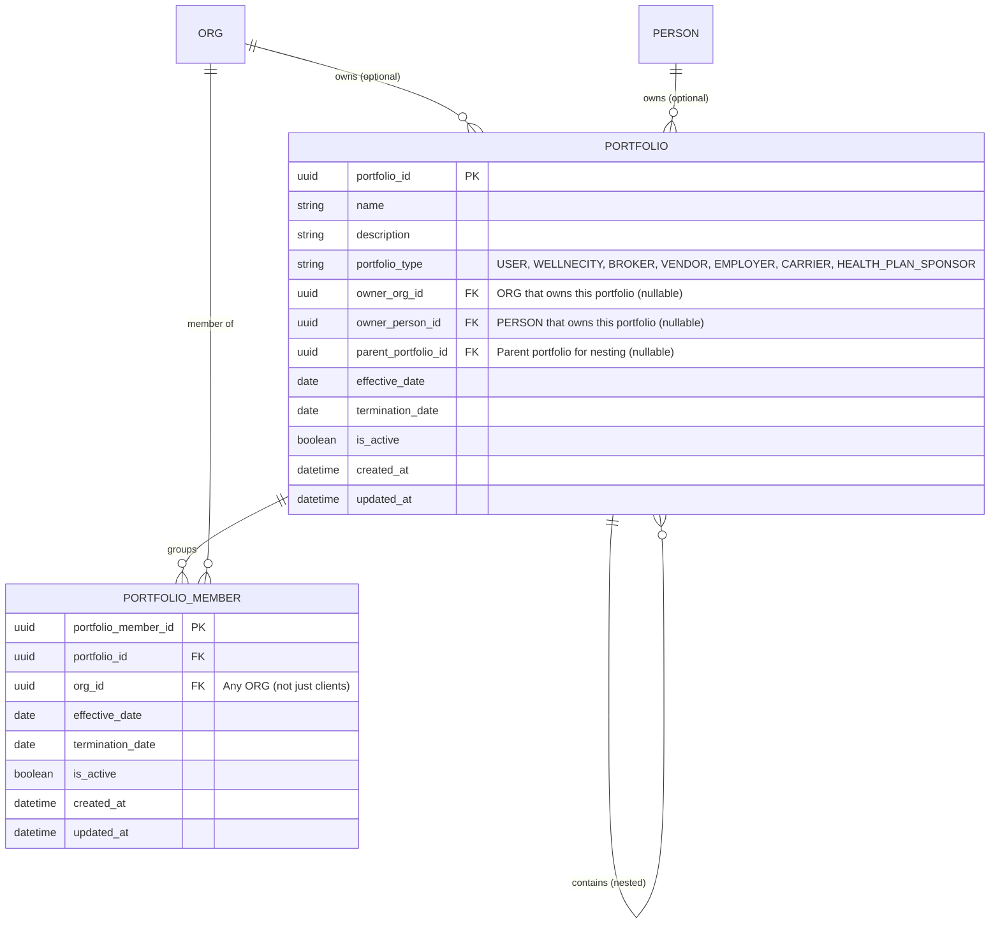
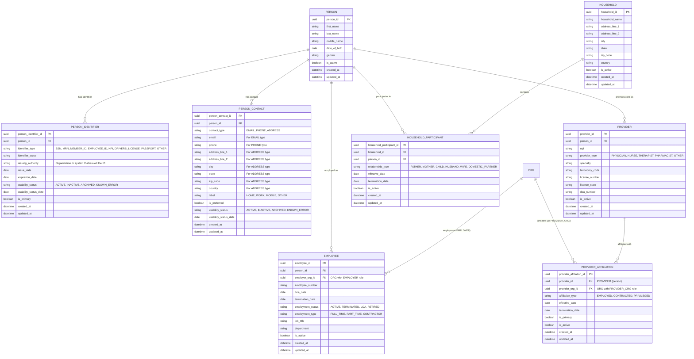
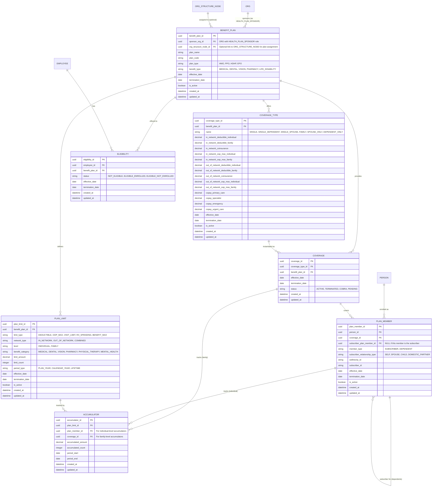

# ORG Entity Relationship Diagram

## Overview

This document defines the comprehensive entity model for the Wellnecity Enterprise Data Model, including:

1. **ORG** — Base entity for all business organizations
2. **PERSON** — Base entity for all individuals

Organizations can have multiple roles and form relationships with other organizations through contracts. Persons can be employees, household participants, health plan members, and/or healthcare providers.

## Design Principles

1. **ORG as Base Entity** — All businesses (employers, clients, vendors, brokers, carriers, provider organizations) inherit from a single ORG entity
2. **PERSON as Base Entity** — All individuals (employees, members, dependents, providers) inherit from a single PERSON entity
3. **Role-Based Architecture** — An ORG can have multiple roles simultaneously; a PERSON can have multiple roles (employee, household participant, member, provider)
4. **Relationship-Centric** — ORG-to-ORG relationships are captured in a dedicated relationship table, with contracts tied to relationships
5. **Role-Specific Extensions** — Each role type has a separate details table for role-specific attributes
6. **Wellnecity as ORG** — Wellnecity is modeled as an ORG in the system with CLIENT relationships

---

## Entity Relationship Diagram — Organizations

### Overview

The Organizations domain establishes the foundation for all business entities within the Wellnecity ecosystem. This includes employers, clients, vendors, brokers, carriers, health plan sponsors, and healthcare provider organizations. Rather than creating separate tables for each organization type, this model uses a single **ORG** base entity with a flexible role system that allows organizations to assume multiple roles simultaneously.

Key relationships between organizations are captured through **ORG_RELATIONSHIP**, enabling the model to represent complex business arrangements such as a broker representing a client, a carrier providing coverage to a client's employees, or Wellnecity providing analytics services. Each relationship can have one or more **CONTRACT** records that formalize the terms of engagement.

### Design Principles

1. **Single Base Entity** — All organizations share common attributes (name, address, tax ID) in the ORG table, eliminating data duplication
2. **Role Flexibility** — An organization can have multiple roles (e.g., an employer that is also a client and health plan sponsor)
3. **Extension Tables** — Role-specific attributes are stored in dedicated detail tables, keeping the base entity clean while supporting specialized data needs
4. **Relationship-Centric** — Business relationships are first-class entities, not implicit foreign keys, enabling rich relationship metadata
5. **Contract Linkage** — Contracts are tied to relationships rather than individual organizations, accurately modeling real-world business agreements
6. **Temporal Tracking** — All roles and relationships include effective and termination dates for historical accuracy

```mermaid
erDiagram
    ORG {
        uuid org_id PK
        string name
        string legal_name
        string website
        boolean is_active
        datetime created_at
        datetime updated_at
    }

    ORG_IDENTIFIER {
        uuid org_identifier_id PK
        uuid org_id FK
        string identifier_type "TAX_ID, FEIN, NPI, NAIC, DUNS, LEI, OTHER"
        string identifier_value
        string issuing_authority "Organization or system that issued the ID"
        date issue_date
        date expiration_date
        string usability_status "ACTIVE, INACTIVE, ARCHIVED, KNOWN_ERROR"
        date usability_status_date
        boolean is_primary
        datetime created_at
        datetime updated_at
    }

    ORG_CONTACT {
        uuid org_contact_id PK
        uuid org_id FK
        string contact_type "EMAIL, PHONE, ADDRESS"
        string email "For EMAIL type"
        string phone "For PHONE type"
        string address_line_1 "For ADDRESS type"
        string address_line_2 "For ADDRESS type"
        string city "For ADDRESS type"
        string state "For ADDRESS type"
        string zip_code "For ADDRESS type"
        string country "For ADDRESS type"
        string label "HEADQUARTERS, BILLING, MAILING, BRANCH, OTHER"
        boolean is_preferred
        string usability_status "ACTIVE, INACTIVE, ARCHIVED, KNOWN_ERROR"
        date usability_status_date
        datetime created_at
        datetime updated_at
    }

    ORG_ROLE {
        uuid org_role_id PK
        uuid org_id FK
        string role_type "EMPLOYER, CLIENT, VENDOR, BROKER, CARRIER, HEALTH_PLAN_SPONSOR, PROVIDER_ORG"
        date effective_date
        date termination_date
        boolean is_active
        datetime created_at
        datetime updated_at
    }

    EMPLOYER_DETAILS {
        uuid employer_details_id PK
        uuid org_role_id FK
        string naics_code
        string sic_code
        string industry
        string size_tier "SMALL, MEDIUM, LARGE, ENTERPRISE"
        integer employee_count
        string fein
        datetime created_at
        datetime updated_at
    }

    CLIENT_DETAILS {
        uuid client_details_id PK
        uuid org_role_id FK
        string client_code
        string account_manager
        string implementation_date
        string client_tier "STANDARD, PREMIUM, ENTERPRISE"
        datetime created_at
        datetime updated_at
    }

    VENDOR_DETAILS {
        uuid vendor_details_id PK
        uuid org_role_id FK
        string vendor_type "TPA, PBM, LAB, CLEARINGHOUSE, OTHER"
        string service_category
        string integration_type "API, SFTP, MANUAL"
        datetime created_at
        datetime updated_at
    }

    BROKER_DETAILS {
        uuid broker_details_id PK
        uuid org_role_id FK
        string license_number
        string license_state
        string broker_type "GENERAL_AGENT, BROKER, CONSULTANT"
        datetime created_at
        datetime updated_at
    }

    CARRIER_DETAILS {
        uuid carrier_details_id PK
        uuid org_role_id FK
        string naic_code
        string carrier_type "COMMERCIAL, MEDICARE, MEDICAID, OTHER"
        string am_best_rating
        datetime created_at
        datetime updated_at
    }

    HEALTH_PLAN_SPONSOR_DETAILS {
        uuid health_plan_sponsor_details_id PK
        uuid org_role_id FK
        string sponsor_type "SELF_INSURED, FULLY_INSURED, LEVEL_FUNDED"
        string funding_arrangement
        datetime created_at
        datetime updated_at
    }

    PROVIDER_ORG_DETAILS {
        uuid provider_org_details_id PK
        uuid org_role_id FK
        string npi
        string facility_type "HOSPITAL, CLINIC, LAB, PHARMACY, IMAGING, OTHER"
        string specialty
        string taxonomy_code
        string license_number
        string license_state
        datetime created_at
        datetime updated_at
    }

    ORG_RELATIONSHIP {
        uuid org_relationship_id PK
        uuid org_id_source FK
        uuid org_id_target FK
        string relationship_type "WELLNECITY_CLIENT, BROKER_CLIENT, CARRIER_CLIENT, VENDOR_CLIENT, PROVIDER_ORG_CLIENT"
        date effective_date
        date termination_date
        boolean is_active
        datetime created_at
        datetime updated_at
    }

    CONTRACT {
        uuid contract_id PK
        uuid org_relationship_id FK
        string contract_type
        string contract_number
        date effective_date
        date termination_date
        string status
        text terms
        datetime created_at
        datetime updated_at
    }

    ORG_STRUCTURE {
        uuid org_structure_id PK
        uuid org_id FK
        string structure_type "FINANCIAL, BENEFIT_ADMIN, REPORTING, GEOGRAPHIC, OPERATIONAL, OTHER"
        string name
        string description
        date effective_date
        date termination_date
        boolean is_active
        datetime created_at
        datetime updated_at
    }

    ORG_STRUCTURE_NODE {
        uuid org_structure_node_id PK
        uuid org_structure_id FK
        uuid parent_node_id FK "NULL for root nodes"
        string node_code
        string name
        string description
        integer level "Depth in hierarchy (0 = root)"
        integer sort_order
        date effective_date
        date termination_date
        boolean is_active
        datetime created_at
        datetime updated_at
    }

    ORG ||--o{ ORG_IDENTIFIER : "has identifier"
    ORG ||--o{ ORG_CONTACT : "has contact"
    ORG ||--o{ ORG_STRUCTURE : "has structure"
    ORG ||--o{ ORG_ROLE : "has"
    ORG_ROLE ||--o| EMPLOYER_DETAILS : "extends"
    ORG_ROLE ||--o| CLIENT_DETAILS : "extends"
    ORG_ROLE ||--o| VENDOR_DETAILS : "extends"
    ORG_ROLE ||--o| BROKER_DETAILS : "extends"
    ORG_ROLE ||--o| CARRIER_DETAILS : "extends"
    ORG_ROLE ||--o| HEALTH_PLAN_SPONSOR_DETAILS : "extends"
    ORG_ROLE ||--o| PROVIDER_ORG_DETAILS : "extends"
    ORG_STRUCTURE ||--o{ ORG_STRUCTURE_NODE : "contains"
    ORG_STRUCTURE_NODE ||--o{ ORG_STRUCTURE_NODE : "parent of"
    ORG ||--o{ ORG_RELATIONSHIP : "source"
    ORG ||--o{ ORG_RELATIONSHIP : "target"
    ORG_RELATIONSHIP ||--o{ CONTRACT : "governs"
```



---

## Entity Relationship Diagram — Portfolios



---

## Entity Relationship Diagram — Persons, Employees, Households, Providers



---

## Entity Relationship Diagram — Benefits, Coverage, Accumulators



---

## Complete Model Summary

### Organization Domain

| Entity | Description |
|--------|-------------|
| **ORG** | Base entity for all business organizations (including Wellnecity) |
| **ORG_IDENTIFIER** | Identifier for an ORG (Tax ID, FEIN, NPI, NAIC, DUNS, etc.) with usability status |
| **ORG_CONTACT** | Contact information for an ORG (email, phone, address) with usability status |
| **ORG_ROLE** | Role assignment for an ORG (EMPLOYER, CLIENT, VENDOR, BROKER, CARRIER, HEALTH_PLAN_SPONSOR, PROVIDER_ORG) |
| **EMPLOYER_DETAILS** | Role-specific attributes for EMPLOYER (NAICS, SIC, industry, size) |
| **CLIENT_DETAILS** | Role-specific attributes for CLIENT (client code, tier, account manager) |
| **VENDOR_DETAILS** | Role-specific attributes for VENDOR (vendor type, integration type) |
| **BROKER_DETAILS** | Role-specific attributes for BROKER (license, broker type) |
| **CARRIER_DETAILS** | Role-specific attributes for CARRIER (NAIC code, carrier type, rating) |
| **HEALTH_PLAN_SPONSOR_DETAILS** | Role-specific attributes for HEALTH_PLAN_SPONSOR (sponsor type, funding) |
| **PROVIDER_ORG_DETAILS** | Role-specific attributes for PROVIDER_ORG (NPI, facility type, specialty) |
| **ORG_RELATIONSHIP** | Relationship between two ORGs (WELLNECITY_CLIENT, BROKER_CLIENT, CARRIER_CLIENT, VENDOR_CLIENT, PROVIDER_ORG_CLIENT) |
| **CONTRACT** | Legal agreement tied to an ORG_RELATIONSHIP |
| **ORG_STRUCTURE** | Internal organizational structure definition (e.g., Financial Divisions, Benefit Administration) |
| **ORG_STRUCTURE_NODE** | Hierarchical node within an ORG_STRUCTURE |

### Portfolio Domain

| Entity | Description |
|--------|-------------|
| **PORTFOLIO** | Flexible grouping of organizations; can be nested and owned by ORG or PERSON |
| **PORTFOLIO_MEMBER** | Links a PORTFOLIO to an ORG (any org, not just clients) |

### Person Domain

| Entity | Description |
|--------|-------------|
| **PERSON** | Base entity for all individuals |
| **PERSON_IDENTIFIER** | Identifier for a PERSON (SSN, MRN, Member ID, etc.) with usability status |
| **PERSON_CONTACT** | Contact information for a PERSON (email, phone, address) with usability status |
| **EMPLOYEE** | Links PERSON to an EMPLOYER ORG |
| **PROVIDER** | Links PERSON to healthcare provider role (replaces PRACTITIONER) |
| **PROVIDER_AFFILIATION** | Links PROVIDER (person) to PROVIDER_ORG with affiliation type |
| **HOUSEHOLD** | Grouping of persons living together |
| **HOUSEHOLD_PARTICIPANT** | Links PERSON to HOUSEHOLD with relationship type |

### Benefits Domain

| Entity | Description |
|--------|-------------|
| **BENEFIT_PLAN** | Health plan offered by a HEALTH_PLAN_SPONSOR ORG; optionally linked to ORG_STRUCTURE_NODE for plan assignment |
| **COVERAGE_TYPE** | Tier within a plan (Single, Family, etc.) with financial limits |
| **PLAN_LIMIT** | Template defining limits for a plan (deductible, OOP max, visit limits, etc.) |
| **ELIGIBILITY** | Links EMPLOYEE to BENEFIT_PLAN with eligibility status |
| **PLAN_MEMBER** | Person enrolled in a COVERAGE (SUBSCRIBER or DEPENDENT) |
| **COVERAGE** | Instance of enrollment in a COVERAGE_TYPE |
| **ACCUMULATOR** | Tracks spending/usage against PLAN_LIMIT for a PLAN_MEMBER or COVERAGE |

---

## Role Types

### ORG Role Types

| Role Type | Description | Details Table |
|-----------|-------------|---------------|
| **EMPLOYER** | Organization that employs employees | EMPLOYER_DETAILS |
| **CLIENT** | Organization with a contractual relationship with Wellnecity | CLIENT_DETAILS |
| **VENDOR** | Organization that provides data or services (e.g., TPA, PBM) | VENDOR_DETAILS |
| **BROKER** | Organization that represents and advises clients | BROKER_DETAILS |
| **CARRIER** | Insurance carrier that provides coverage | CARRIER_DETAILS |
| **HEALTH_PLAN_SPONSOR** | Organization that sponsors a health plan (can be CARRIER or EMPLOYER) | HEALTH_PLAN_SPONSOR_DETAILS |
| **PROVIDER_ORG** | Healthcare facility or organization (hospital, clinic, lab) | PROVIDER_ORG_DETAILS |

### ORG Identifier Types

| Identifier Type | Description |
|-----------------|-------------|
| **TAX_ID** | Tax Identification Number |
| **FEIN** | Federal Employer Identification Number |
| **NPI** | National Provider Identifier (for provider organizations) |
| **NAIC** | National Association of Insurance Commissioners code (for carriers) |
| **DUNS** | Dun & Bradstreet Universal Numbering System |
| **LEI** | Legal Entity Identifier |
| **OTHER** | Other identifier type |

### ORG Contact Labels

| Label | Description |
|-------|-------------|
| **HEADQUARTERS** | Main headquarters address |
| **BILLING** | Billing address |
| **MAILING** | Mailing address |
| **BRANCH** | Branch office |
| **OTHER** | Other contact type |

### ORG Relationship Types

| Relationship Type | Source Role | Target Role | Description |
|-------------------|-------------|-------------|-------------|
| **WELLNECITY_CLIENT** | Wellnecity | CLIENT | Wellnecity provides analytics/services to client |
| **BROKER_CLIENT** | BROKER | CLIENT | Broker represents and advises client |
| **CARRIER_CLIENT** | CARRIER | CLIENT | Carrier provides insurance coverage |
| **VENDOR_CLIENT** | VENDOR | CLIENT | Vendor provides data/services to client |
| **PROVIDER_ORG_CLIENT** | PROVIDER_ORG | CLIENT | Provider organization has network contract with client |

### ORG Structure Types

| Structure Type | Description |
|----------------|-------------|
| **FINANCIAL** | Financial divisions, cost centers, budget units |
| **BENEFIT_ADMIN** | Benefit administration groups, eligibility classes |
| **REPORTING** | Reporting hierarchies, analytics groupings |
| **GEOGRAPHIC** | Geographic regions, locations, territories |
| **OPERATIONAL** | Operational units, departments, teams |
| **OTHER** | Other custom structure type |

### Person Role Types

| Role Type | Description | Entity |
|-----------|-------------|--------|
| **EMPLOYEE** | Person employed by an EMPLOYER ORG | EMPLOYEE |
| **PROVIDER** | Person who provides healthcare services (doctor, nurse, etc.) | PROVIDER |
| **PLAN_MEMBER** | Person enrolled in a health plan | PLAN_MEMBER |
| **HOUSEHOLD_PARTICIPANT** | Person participating in a household | HOUSEHOLD_PARTICIPANT |

### Person Identifier Types

| Identifier Type | Description |
|-----------------|-------------|
| **SSN** | Social Security Number |
| **MRN** | Medical Record Number |
| **MEMBER_ID** | Health plan member identifier |
| **EMPLOYEE_ID** | Employer-assigned employee identifier |
| **NPI** | National Provider Identifier |
| **DRIVERS_LICENSE** | Driver's license number |
| **PASSPORT** | Passport number |
| **OTHER** | Other identifier type |

### Person Contact Types

| Contact Type | Description |
|--------------|-------------|
| **EMAIL** | Email address |
| **PHONE** | Phone number |
| **ADDRESS** | Physical/mailing address |

### Person Contact Labels

| Label | Description |
|-------|-------------|
| **HOME** | Home contact |
| **WORK** | Work contact |
| **MOBILE** | Mobile phone |
| **OTHER** | Other contact type |

### Usability Status Types

| Status | Description |
|--------|-------------|
| **ACTIVE** | Currently valid and usable |
| **INACTIVE** | No longer in active use but still valid |
| **ARCHIVED** | Historical record, no longer usable |
| **KNOWN_ERROR** | Contains known errors or issues |

### Plan Member Types

| Member Type | Description |
|-------------|-------------|
| **SUBSCRIBER** | A plan member who is also an employee; the primary enrollee |
| **DEPENDENT** | A plan member who receives coverage through a subscriber |

### Subscriber Relationship Types

| Relationship Type | Description |
|-------------------|-------------|
| **SELF** | The subscriber themselves |
| **SPOUSE** | Spouse of the subscriber |
| **CHILD** | Child of the subscriber |
| **DOMESTIC_PARTNER** | Domestic partner of the subscriber |

### Household Relationship Types

| Relationship Type | Description |
|-------------------|-------------|
| **FATHER** | Father in the household |
| **MOTHER** | Mother in the household |
| **CHILD** | Child in the household |
| **HUSBAND** | Husband in the household |
| **WIFE** | Wife in the household |
| **DOMESTIC_PARTNER** | Domestic partner in the household |

### Eligibility Status Types

| Status | Description |
|--------|-------------|
| **NOT_ELIGIBLE** | Employee is not eligible for the benefit plan |
| **ELIGIBLE_ENROLLED** | Employee is eligible and has enrolled |
| **ELIGIBLE_NOT_ENROLLED** | Employee is eligible but has not enrolled |

### Coverage Type Names

| Name | Description |
|------|-------------|
| **SINGLE** | Employee only |
| **SINGLE_DEPENDENT** | Employee plus one dependent |
| **SINGLE_SPOUSE** | Employee plus spouse |
| **FAMILY** | Employee plus spouse and children |
| **SPOUSE_ONLY** | Spouse only (employee waived) |
| **DEPENDENT_ONLY** | Dependent only (employee waived) |

### Plan Limit Types

| Limit Type | Description |
|------------|-------------|
| **DEDUCTIBLE** | Amount plan member pays before plan pays |
| **OOP_MAX** | Maximum out-of-pocket spending per period |
| **VISIT_LIMIT** | Maximum number of visits (e.g., PT visits) |
| **RX_SPENDING** | Pharmacy spending limits |
| **BENEFIT_MAX** | Maximum benefit amount (e.g., dental max) |

### Provider Affiliation Types

| Affiliation Type | Description |
|------------------|-------------|
| **EMPLOYED** | Provider is employed by the organization |
| **CONTRACTED** | Provider has a contract with the organization |
| **PRIVILEGED** | Provider has privileges at the facility |

### Portfolio Types

| Portfolio Type | Description | Typical Owner |
|----------------|-------------|---------------|
| **USER** | Personal portfolio for a team member | PERSON |
| **WELLNECITY** | Internal Wellnecity team grouping | ORG (Wellnecity) |
| **BROKER** | Organizations grouped by broker | ORG (BROKER role) |
| **VENDOR** | Organizations grouped by vendor | ORG (VENDOR role) |
| **EMPLOYER** | Organizations grouped by employer | ORG (EMPLOYER role) |
| **CARRIER** | Organizations grouped by carrier | ORG (CARRIER role) |
| **HEALTH_PLAN_SPONSOR** | Organizations grouped by plan sponsor | ORG (HEALTH_PLAN_SPONSOR role) |

---

## Example Scenarios

### Scenario 1: Self-Insured Employer with Employee and Family

```
ORG: "Wellnecity" (org_id: WNC-001)
├── Roles: [VENDOR]
│   └── VENDOR_DETAILS: { vendor_type: "ANALYTICS_PLATFORM" }

ORG: "ABC Corporation" (org_id: ABC-001)
├── Roles: [CLIENT, EMPLOYER, HEALTH_PLAN_SPONSOR]
│   ├── CLIENT_DETAILS: { client_code: "ABC", client_tier: "ENTERPRISE" }
│   ├── EMPLOYER_DETAILS: { naics_code: "541512", employee_count: 500 }
│   └── HEALTH_PLAN_SPONSOR_DETAILS: { sponsor_type: "SELF_INSURED" }
├── Relationships:
│   ├── WELLNECITY_CLIENT (with Wellnecity)
│   │   └── Contract: Analytics Services Agreement
│   └── VENDOR_CLIENT (with "Brighton TPA")
│       └── Contract: TPA Services Agreement
├── BENEFIT_PLAN: "ABC Medical PPO"
│   ├── COVERAGE_TYPE: "Family"
│   │   ├── in_network_deductible_individual: $500
│   │   ├── in_network_deductible_family: $1,500
│   │   ├── in_network_oop_max_individual: $3,000
│   │   └── in_network_oop_max_family: $6,000
│   └── PLAN_LIMIT: [ Deductible, OOP Max, 20 PT Visits ]
│
└── EMPLOYEE: John Smith (PERSON)
    ├── hire_date: 2020-01-15
    ├── employment_status: ACTIVE
    ├── ELIGIBILITY: ABC Medical PPO → ELIGIBLE_ENROLLED
    │
    └── COVERAGE (coverage_type: Family)
        ├── PLAN_MEMBER: John Smith (SUBSCRIBER, SELF)
        │   └── ACCUMULATOR: { deductible: $200 of $500, oop: $500 of $3,000 }
        ├── PLAN_MEMBER: Jane Smith (DEPENDENT, SPOUSE)
        │   └── ACCUMULATOR: { deductible: $150 of $500, oop: $300 of $3,000 }
        ├── PLAN_MEMBER: Tommy Smith (DEPENDENT, CHILD)
        │   └── ACCUMULATOR: { deductible: $0 of $500, oop: $0 of $3,000 }
        └── ACCUMULATOR (Family): { deductible: $350 of $1,500, oop: $800 of $6,000 }

HOUSEHOLD: "Smith Family"
├── HOUSEHOLD_PARTICIPANT: John Smith (HUSBAND)
├── HOUSEHOLD_PARTICIPANT: Jane Smith (WIFE)
└── HOUSEHOLD_PARTICIPANT: Tommy Smith (CHILD)
```

### Scenario 2: Provider and Provider Organization

```
ORG: "City General Hospital" (org_id: CGH-001)
├── Roles: [PROVIDER_ORG]
│   └── PROVIDER_ORG_DETAILS:
│       ├── npi: "1234567890"
│       ├── facility_type: "HOSPITAL"
│       └── taxonomy_code: "282N00000X"

PERSON: "Dr. Sarah Johnson" (person_id: PSJ-001)
├── PROVIDER:
│   ├── npi: "9876543210"
│   ├── provider_type: "PHYSICIAN"
│   ├── specialty: "Internal Medicine"
│   └── taxonomy_code: "207R00000X"
└── PROVIDER_AFFILIATION:
    ├── provider_org: "City General Hospital"
    ├── affiliation_type: "PRIVILEGED"
    └── is_primary: true
```

### Scenario 3: Nested Portfolios

```
PORTFOLIO: "West Region" (type: WELLNECITY, owner: Wellnecity ORG)
├── PORTFOLIO: "California" (type: WELLNECITY, parent: West Region)
│   ├── PORTFOLIO_MEMBER: "Acme Corp" (ORG)
│   ├── PORTFOLIO_MEMBER: "Beta Inc" (ORG)
│   └── PORTFOLIO_MEMBER: "Pacific Health" (ORG)
├── PORTFOLIO: "Oregon" (type: WELLNECITY, parent: West Region)
│   ├── PORTFOLIO_MEMBER: "Columbia Co" (ORG)
│   └── PORTFOLIO_MEMBER: "Portland Health" (ORG)
└── PORTFOLIO_MEMBER: "Regional Services LLC" (ORG, directly in West Region)

PORTFOLIO: "XYZ Benefits Clients" (type: BROKER, owner: XYZ Benefits Consulting ORG)
├── PORTFOLIO_MEMBER: "Acme Corp" (ORG) ← same org can be in multiple portfolios
├── PORTFOLIO_MEMBER: "Small Business Inc" (ORG)
└── PORTFOLIO_MEMBER: "Tech Startup LLC" (ORG)

PORTFOLIO: "John Quinn's Accounts" (type: USER, owner: John Quinn PERSON)
├── PORTFOLIO_MEMBER: "Acme Corp" (ORG)
└── PORTFOLIO_MEMBER: "Beta Inc" (ORG)

PORTFOLIO: "BCBS Covered Employers" (type: CARRIER, owner: Blue Cross Blue Shield ORG)
├── PORTFOLIO_MEMBER: "Small Business Inc" (ORG)
├── PORTFOLIO_MEMBER: "Retail Chain Co" (ORG)
└── PORTFOLIO_MEMBER: "Manufacturing Inc" (ORG)
```

---

## Migration Notes

### Refactoring Existing Entities

| Current Entity | Migration Path |
|----------------|----------------|
| EMPLOYER | Create ORG record + ORG_ROLE (EMPLOYER) + EMPLOYER_DETAILS |
| VENDOR | Create ORG record + ORG_ROLE (VENDOR) + VENDOR_DETAILS |
| PRACTITIONER | Create PERSON record + PROVIDER; link to PROVIDER_ORG via PROVIDER_AFFILIATION |
| MEMBER (current) | Split into PERSON + PLAN_MEMBER; create EMPLOYEE if applicable |

### New Entities to Create

| Entity | Notes |
|--------|-------|
| ORG_ROLE detail tables | EMPLOYER_DETAILS, CLIENT_DETAILS, VENDOR_DETAILS, BROKER_DETAILS, CARRIER_DETAILS, HEALTH_PLAN_SPONSOR_DETAILS, PROVIDER_ORG_DETAILS |
| PERSON | Base entity for all individuals |
| EMPLOYEE | Links PERSON to EMPLOYER ORG |
| PROVIDER | Links PERSON to healthcare provider role |
| PROVIDER_AFFILIATION | Links PROVIDER to PROVIDER_ORG |
| HOUSEHOLD | New entity for household grouping |
| HOUSEHOLD_PARTICIPANT | Junction table with relationship types |
| COVERAGE_TYPE | Tier within a plan with financial limits |
| PLAN_LIMIT | Template for plan limits |
| ELIGIBILITY | Links EMPLOYEE to BENEFIT_PLAN with status |
| ACCUMULATOR | Tracks spending against PLAN_LIMIT |
| PORTFOLIO | Flexible grouping of organizations |
| PORTFOLIO_MEMBER | Junction table linking portfolios to organizations |

### Foreign Key Updates

| Entity | Current FK | New FK | Notes |
|--------|------------|--------|-------|
| PLAN_MEMBER | employer_id | person_id, coverage_id | Now links to PERSON and COVERAGE |
| CONTRACT | employer_id, vendor_id | org_relationship_id | Contracts now tied to relationships |
| DATA_FEED | vendor_id | org_id | Relationship is through VENDOR role |
| COVERAGE | benefit_plan_id | coverage_type_id, benefit_plan_id | Now links to COVERAGE_TYPE |

---

## Version History

| Version | Date | Author | Changes |
|---------|------|--------|---------|
| 0.1 | 2026-01-25 | quinnj105 | Initial draft - ORG model |
| 0.2 | 2026-01-25 | quinnj105 | Added PERSON, EMPLOYEE, HOUSEHOLD, MEMBER, ELIGIBILITY, BENEFIT_PLAN, COVERAGE |
| 0.3 | 2026-01-25 | quinnj105 | Added PROVIDER_ORG role, PROVIDER entity, PROVIDER_AFFILIATION; Added role-specific detail tables; Added COVERAGE_TYPE, PLAN_LIMIT, ACCUMULATOR; Wellnecity as ORG; Resolved all open questions |
| 0.4 | 2026-01-25 | quinnj105 | Added PORTFOLIO and PORTFOLIO_MEMBER for flexible organization grouping; Portfolios can be nested and owned by ORG or PERSON |
| 0.5 | 2026-01-25 | quinnj105 | Renamed MEMBER to PLAN_MEMBER to distinguish from PORTFOLIO_MEMBER |
| 0.6 | 2026-01-26 | quinnj105 | Added PERSON_CONTACT entity for multiple contact records (email, phone, address) with preferred flag; Removed inline contact fields from PERSON |
| 0.7 | 2026-01-26 | quinnj105 | Added PERSON_IDENTIFIER entity for multiple IDs (SSN, MRN, Member ID, etc.); Added usability_status and usability_status_date to PERSON_CONTACT and PERSON_IDENTIFIER; Removed ssn_last_four from PERSON |
| 0.8 | 2026-01-26 | quinnj105 | Added ORG_IDENTIFIER entity for multiple org IDs (Tax ID, FEIN, NPI, NAIC, DUNS, LEI); Added ORG_CONTACT entity for multiple org contacts; Removed inline contact/tax_id fields from ORG |
| 0.9 | 2026-01-26 | quinnj105 | Added ORG_STRUCTURE and ORG_STRUCTURE_NODE entities for internal organizational hierarchies (Financial, Benefit Admin, Reporting, Geographic, Operational) |
| 0.10 | 2026-01-26 | quinnj105 | Added optional org_structure_node_id to BENEFIT_PLAN for linking plans to organizational hierarchies; Supports multiple plans per sponsor with different structure assignments |
